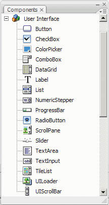

# Component types

You install the Flash components when you install Flash CS5.

ActionScript 3.0 components include the following user interface (UI)
components:

|             |                |             |
| ----------- | -------------- | ----------- |
| Button      | List           | TextArea    |
| CheckBox    | NumericStepper | TextInput   |
| ColorPicker | RadioButton    | TileList    |
| ComboBox    | ProgressBar    | UILoader    |
| DataGrid    | ScrollPane     | UIScrollBar |
| Label       | Slider         |             |

In addition to the user interface components, the Flash ActionScript 3.0
components include the following components and supporting classes:

- FLVPlayback component (fl.video.FLVPlayback), which is a SWC-based component.

  The FLVPlayback component lets you readily include a video player in your
  Flash application to play progressive streaming video over HTTP, from an
  Adobe® Flash® Video Streaming Service (FVSS), or from Adobe's Macromedia®
  Flash® Media Server (FMS). For more information, see
  [Using the FLVPlayback Component](../using-the-flvplayback-component/index.md).

- The FLVPlayback Custom UI components, which are FLA-based and work with both
  the ActionScript 2.0 and ActionScript 3.0 versions of the FLVPlayback
  component. For more information, see
  [Using the FLVPlayback Component](../using-the-flvplayback-component/index.md).

- The FLVPlayback Captioning component, which provides closed captioning for
  FLVPlayback. See
  [Using the FLVPlayback Captioning Component](../using-the-flvplayback-captioning-component/index.md).

  For a complete list of the ActionScript 3.0 components and their supporting
  classes, see the
  [ActionScript 3.0 Reference for the Adobe Flash Platform](https://help.adobe.com/en_US/FlashPlatform/reference/actionscript/3/index.html).

#### View Flash components:

You can view the Flash ActionScript 3.0 components in the Components panel by
following these steps.

1.  Start Flash.

2.  Create a new Flash file (ActionScript 3.0) or open an existing Flash
    document in which the Publish Settings specify ActionScript 3.0.

3.  Select Window \> Components to open the Components panel, if it isn't
    already open.

    

    <caption>Components panel with User Interface components</caption>

    You can also download additional components from the
    [Adobe Flash Professional Exchange](https://web.archive.org/web/20110811114614/http://www.adobe.com/cfusion/exchange/index.cfm?event=productHome&exc=2&loc=en_us).
    To install components downloaded from the Exchange, download and install the
    [Adobe® Extension Manager](https://www.adobe.com/exchange/em_download/).

    Any component can appear in the Components panel in Flash. Follow these
    steps to install components on either a Windows® or Macintosh® computer.

#### Install components on a Windows-based or a Macintosh computer:

1.  Quit Flash.

2.  Place the SWC or FLA file containing the component in the following folder
    on your hard disk:

    - In Windows:

      C:\Program Files\Adobe\Adobe Flash CS5\\ _language_
      \Configuration\Components

    - On the Macintosh:

      Macintosh HD:Applications:Adobe Flash CS5:Configuration:Components

3.  Start Flash.

4.  Select Window \> Components to view the component in the Components panel if
    it isn't already open.

    For more information about component files, see
    [Working with component files](../working-with-components/working-with-component-files.md).
