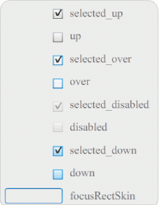

# About Skins

A component's appearance is made up of graphical elements such as an outline, a
fill color, icons, and even other components. A ComboBox, for example, contains
a List component and a List component contains a ScrollBar. Together the
graphical elements make up the appearance for the ComboBox. A component's
appearance changes, however, based on its current state. For example, a
CheckBox, without its label, looks something like this when it appears in your
application:

<caption>A CheckBox in its normal up state</caption>

If you click the mouse button and hold it down on the CheckBox, its appearance
changes to this:

<caption>A CheckBox in its down state</caption>

And when you release the mouse button, the CheckBox reverts to its original
appearance but now has a check mark to show that it has been selected.

<caption>A CheckBox in its selected state</caption>

Collectively, the icons that represent the component in its various states are
called its _skins._ You can change a component's appearance in any or all of its
states by editing its skins in Flash, just as you would any other Flash symbol.
You can access a component's skins in two ways. The easiest way is to drag the
component to the Stage and double-click it. This opens a palette of the
component's skins, which looks like this for a CheckBox.

<caption>A CheckBox's skins</caption>

You can also access a component's skins individually from the Library panel.
When you drag a component to the Stage, you also copy it to the library along
with a folder of its assets and any other components that it contains. For
example, if you drag a ComboBox to the Stage, the Library panel will also
contain the List, ScrollBar, and TextInput components, which are built into the
ComboBox, along with a folder of skins for each of these components and a Shared
Assets folder that contains elements that these components share. You can edit
the skins for any of these components by opening its skins folder
(ComboBoxSkins, ListSkins, ScrollBarSkins, or TextInputSkins) and
double-clicking the icon for the skin that you want to edit. Double-clicking
ComboBox_downSkin, for example, opens the skin in symbol editing mode, as shown
in the following illustration:

<caption>The ComboBox_downSkin</caption>

## Create a new skin

If you want to create a new look for a component in your document, you edit the
component's skins to change their appearance. To access a component's skins,
simply double-click the component on the Stage to open a palette of its skins.
Then double-click the skin that you want to edit to open it in symbol-editing
mode. For example, double-click the TextArea component on the Stage to open its
assets in symbol-editing mode. Set the zoom control to 400%, or higher if you
like, and edit the symbol to change its look. When you're finished, the change
will affect all instances of the component in the document. As an alternative,
you can double-click a particular skin in the Library panel to open it on the
Stage in symbol-editing mode.

You can modify component skins in the following ways:

- Create a new skin for all instances

- Create new skins for some instances

### Create a skin for all instances

When you edit a component's skin, by default you change the component's
appearance for all instances of it in the document. If you want to create
different looks for the same component, you must duplicate the skins that you
want to change and give them different names, edit them, and then set the
appropriate styles to apply them. For more information, see
[Create skins for some instances](#create-skins-for-some-instances).

This chapter describes how to alter one or more skins for each of the UI
components. If you follow one of these procedures to change one or more of a UI
component's skins, you will change it for all instances in the document.

### Create skins for some instances

You can create a skin for some instances of a component using the following
general procedure:

- Select the skin in the component's Assets folder in the Library panel.

- Duplicate the skin and assign it a unique class name.

- Edit the skin to give it the appearance you want.

- Call the `setStyle()` method for the component instance to assign the new skin
  to the skin style.

The following procedure creates a new selectedDownSkin for one of two Button
instances.

1.  Create a new Flash file (ActionScript 3.0) document.

2.  Drag two Buttons from the Components panel onto the Stage and give them
    instance names of **aButton** and **bButton**.

3.  Open the Library panel and then the Component Assets and ButtonSkins folders
    within it.

4.  Click the selectedDownSkin skin to select it.

5.  Right-click to open the context menu and select Duplicate.

6.  In the Duplicate Symbol dialog box, give the new skin a unique name, for
    example **Button_mySelectedDownSkin**. Then click OK.

7.  In the Library \> Component Assets \> ButtonSkins folder, select
    Button_mySelectedDownSkin and right-click to open the context menu. Select
    Linkage to open the Linkage Properties dialog box.

8.  Click the Export For ActionScript check box. Leave the Export In First Frame
    check box selected and ensure that the class name is unique. Click OK, and
    then click OK again in response to the warning that says a class definition
    could not be found and one will be created.

9.  Double-click the Button_mySelectedDownSkin skin in the Library panel to open
    it in symbol-editing mode.

10. Click the blue fill in the center of the skin until the color appears in the
    Fill color picker in the Property inspector. Click the color picker and
    select color \#00CC00 for the skin fill.

11. Click the Back button at the left side of the edit bar above the Stage to
    return to document-editing mode.

12. In the Property inspector, click the Parameters tab for each button and set
    the toggle parameter to `true`.

13. Add the following code to the Actions panel on Frame 1 of the Timeline:

        bButton.setStyle("selectedDownSkin", Button_mySelectedDownSkin);
        bButton.setStyle("downSkin", Button_mySelectedDownSkin);

14. Select Control \> Text Movie.

15. Click each button. Note that the down skin (selected and unselected) for the
    bButton object uses the new skin symbol.
