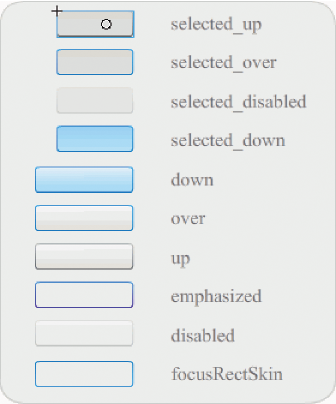
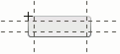
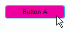

# Customize the Button component

You can transform a Button component horizontally and vertically while authoring
and at run time. While authoring, select the component on the Stage and use the
Free Transform tool or any of the Modify \> Transform commands. At run time, use
the `setSize()` method or any applicable properties of the Button class, such as
`height` and `width`, and `scaleX` and `scaleY`.

Resizing the button does not change the size of the icon or label. The bounding
box of a Button corresponds to the Button's border and also designates the hit
area for the instance. If you increase the size of the instance, you also
increase the size of the hit area. If the bounding box is too small to fit the
label, the label is clipped to fit.

If the Button has an icon and it is larger than the Button, the icon extends
beyond the Button's borders.

## Use styles with the Button component

A Button's styles generally specify values for a Button's skins, icons, text
formatting, and padding when the component is drawn in its various states.

The following procedure puts two Buttons on the Stage and sets the `emphasized`
property to `true` for both Buttons when the user clicks one of them. It also
sets the `emphasizedSkin` style for the second Button to the `selectedOverSkin`
style when the user clicks it so the two Buttons show different skins for the
same state.

1.  Create a Flash file (ActionScript 3.0).

2.  Drag two Buttons to the Stage, one at a time, and give them instance names
    of **aBtn** and **bBtn**. In the Parameters tab of the Property inspector,
    give them labels of Button A and Button B.

3.  Add the following code to the Actions panel on Frame 1 of the Timeline:

        bBtn.emphasized = true;
        aBtn.emphasized = true;
        bBtn.addEventListener(MouseEvent.CLICK, Btn_handler);
        function Btn_handler(evt:MouseEvent):void {
            bBtn.setStyle("emphasizedSkin", "Button_selectedOverSkin");
        }

4.  Select Control \> Test Movie.

5.  Click one of the buttons to see the effect of the `emphasizedSkin` style on
    each button.

## Use skins with the Button component

The Button component uses the following skins that correspond to its different
states. To edit one or more skins to change the Button's appearance,
double-click the Button instance on the Stage to open a palette of its skins, as
shown in the following illustration:

<caption>Button skins</caption>

If a button is enabled, it displays its over state when the pointer moves over
it. The button receives input focus and displays its down state when it's
pressed. The button returns to its over state when the mouse is released. If the
pointer moves off the button while the mouse is pressed, the button returns to
its original state. If the toggle parameter is set to `true`, the pressed state
is shown with the selectedDownSkin, the up state with the selectedUpSkin, and
the over state with the selectedOverSkin.

If a Button is disabled, it displays its disabled state, regardless of user
interaction.

To edit one of the skins, double-click it to open it in symbol-editing mode, as
shown in the following illustration:

<caption>Button in symbol-editing mode</caption>

At this point you can use the Flash authoring tools to edit the skin to your
liking.

The following procedure changes the color of the Button's selected_over skin.

1.  Create new Flash file (ActionScript 3.0).

2.  Drag a Button from the Components panel to the Stage. In the Parameters tab,
    set the toggle parameter to `true`.

3.  Double-click the Button to open the palette of its skins.

4.  Double-click the selected_over skin to open it in symbol-editing mode.

5.  Set the zoom control to 400% to enlarge the icon for editing.

6.  Double-click the background until its color appears in the Fill color picker
    in the Property inspector.

7.  Select color \#CC0099 in the Fill color picker to apply it to the background
    of the selected_over skin.

8.  Click the Back button at the left side of the edit bar above the Stage to
    return to document-editing mode.

9.  Select Control \> Test Movie.

10. Click the button to put it in the selected state.

    When you move the mouse pointer over the Button, the selected_over state
    should appear as it does in the following illustration.

    

    <caption>Button showing selected_over skin with modified color</caption>
