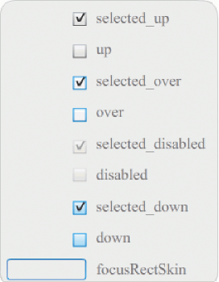

# Customize the CheckBox component

You can transform a CheckBox component horizontally and vertically while
authoring and at run time. While authoring, select the component on the Stage
and use the Free Transform tool or any of the Modify \> Transform commands. At
run time, use the `setSize()` method or applicable properties of the CheckBox
class. For example, you can change the size of a CheckBox by setting its
`height` and `width` and `scaleX` and `scaleY` properties. Resizing the CheckBox
does not change the size of the label or the check box icon; it only changes the
size of the bounding box.

The bounding box of a CheckBox instance is invisible and also designates the hit
area for the instance. If you increase the size of the instance, you also
increase the size of the hit area. If the bounding box is too small to fit the
label, the label is clipped to fit.

## Use styles with the CheckBox

You can set style properties to change the appearance of a CheckBox instance.
For example, the following procedure changes the size and color of a CheckBox
label.

1.  Drag the CheckBox component from the Components panel to the Stage and give
    it an instance name of **myCb.**

2.  Click the Parameters tab in the Property inspector and enter the following
    value for the label parameter: **Less than \$500?**

3.  On Frame 1 of the main Timeline, enter the following code in the Actions
    Panel:

        var myTf:TextFormat = new TextFormat();
        myCb.setSize(150, 22);
        myTf.size = 16;
        myTf.color = 0xFF0000;
        myCb.setStyle("textFormat", myTf);

    For more information, see [Setting styles](./setting-styles.md). For
    information on setting style properties to change the component's icons and
    skins, see [Create a new skin](./about-skins.md#create-a-new-skin) and
    [Use skins with the CheckBox](#use-skins-with-the-checkbox).

## Use skins with the CheckBox

The CheckBox component has the following skins, which you can edit to change its
appearance.

<caption>CheckBox skins</caption>

This example changes the outline color and background color of the component in
its `up` and `selectedUp` states. You would follow similar steps to change the
skins for other states.

1.  Create a new Flash file (ActionScript 3.0) document.

2.  Drag the CheckBox component to the Stage, which also places it in the
    library with a folder of its assets.

3.  Double-click the CheckBox component on the Stage to open its panel of skin
    icons.

4.  Double-click the selected_up icon to open it in symbol-editing mode.

5.  Set the zoom control to 800% to enlarge the icon for editing.

6.  Click the border of the CheckBox to select it. Use the Fill color picker in
    the Property inspector to select color \#0033FF and apply it to the border.

7.  Double-click the background of the CheckBox to select it and again use the
    Fill color picker to set the color of the background to \#00CCFF.

8.  Repeat steps 4 to 8 for the CheckBox up skin.

9.  Select Control \> Test Movie.
