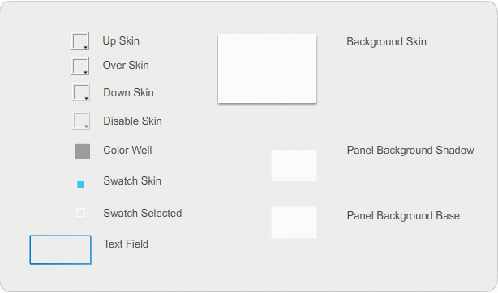
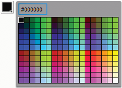

# Customize the ColorPicker component

The only resizing that you can do to a ColorPicker is through its styles:
`swatchWidth`, `swatchHeight`, `backgroundPadding`, `textFieldWidth`, and
`textFieldHeight`. If you try to change the size of the ColorPicker with the
Transform tool or with ActionScript using the `setSize()` method, or the
`width`, `height`, `scaleX`, or `scaleY` properties, these values are ignored
when you create the SWF file and the ColorPicker displays at its default size.
The palette background will resize to match the number of columns that has been
set using `setStyle()` for the `columnCount` style. The default number of
columns is 18. You can set custom colors to 1024 and the palette will resize
vertically to match the number of swatches.

## Use Styles with the ColorPicker component

You can set several styles to change the appearance of the ColorPicker
component. For example the following procedure changes the number of columns (
`columnCount`) in the ColorPicker to 12, changes the height ( `swatchHeight`)
and width ( `swatchWidth`) of the color swatches, and changes the padding for
both the text field ( `textPadding`) and the background ( `backgroundPadding`).

1.  Create a new Flash file (ActionScript 3.0) document.

2.  Drag the ColorPicker component to the Stage and give it an instance name of
    **aCp**.

3.  Open the Actions panel, select Frame 1 in the main Timeline and enter the
    following code:

        aCp.setStyle("columnCount", 12);
        aCp.setStyle("swatchWidth", 8);
        aCp.setStyle("swatchHeight", 12);
        aCp.setStyle("swatchPadding", 2);
        aCp.setStyle("backgroundPadding", 3);
        aCp.setStyle("textPadding", 7);

4.  Select Control \> Test Movie.

5.  Click the ColorPicker to open it and see how these settings have altered its
    appearance.

## Use Skins with the ColorPicker component

The ColorPicker component uses the following skins to represent its visual
states.

<caption>ColorPicker skins</caption>

You can change the color of the Background skin to change the color of the
palette background.

1.  Create a new Flash file (ActionScript 3.0) document.

2.  Drag the ColorPicker component to the Stage.

3.  Double-click it to open its palette of skins.

4.  Double-click the Background skin until it is selected and the Fill color
    picker appears in the Property inspector.

5.  Select color \#999999 using the Fill color picker to apply it to the
    Background skin.

6.  Click the Back button at the left side of the edit bar above the Stage to
    return to document-editing mode.

7.  Select Control \> Test Movie.

    When you click on the ColorPicker, the background of the palette should be
    gray as shown in the following illustration.

    

    <caption>ColorPicker with dark gray Background skin</caption>
