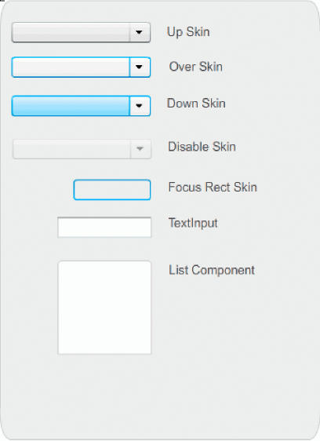

# Customize the ComboBox component

You can transform a ComboBox component horizontally and vertically while
authoring and at run time. While authoring, select the component on the Stage
and use the Free Transform tool or any of the Modify \> Transform commands. At
run time, use the `setSize()` method or applicable properties of the ComboBox
class such as `height` and `width` and `scaleX` and `scaleY`.

The ComboBox will resize to fit the specified width and height. The list will
resize to fit the width of the component, unless the `dropdownWidth` property
has been set.

If the text is too long to fit in the ComboBox, the text is clipped to fit. You
must resize the ComboBox and set the `dropdownWidth` property to fit the text.

## Use Styles with the ComboBox component

You can set style properties to change the appearance of a ComboBox component.
The styles specify values for the component's skins, cell renderer, padding, and
button width. The following example sets the `buttonWidth` and `textPadding`
styles. The `buttonWidth` style sets the width of the button's hit area and is
in effect when the ComboBox is editable and you can only press the button to
open the drop-down list.The textPadding style specifies the amount of space
between the outside border of the text field and the text. It is useful for
centering the text vertically in the text field if you make the ComboBox taller.
Otherwise the text could appear to be at the top of the text field.

1.  Create a new Flash file (ActionScript 3.0) document.

2.  Drag the ComboBox component to the Stage and give it an instance name of
    **aCb**.

3.  Open the Actions panel, select Frame 1 in the main Timeline and enter the
    following code:

        import fl.data.DataProvider;

        aCb.setSize(150, 35);
        aCb.setStyle("textPadding", 10);
        aCb.setStyle("buttonWidth", 10);
        aCb.editable = true;

        var items:Array = [
            {label:"San Francisco", data:"601 Townsend St."},
            {label:"San Jose", data:"345 Park Ave."},
            {label:"San Diego", data:"10590 West Ocean Air Drive, Suite 100"},
            {label:"Santa Rosa", data:"2235 Mercury Way, Suite 105"},
            {label:"San Luis Obispo", data:"3220 South Higuera Street, Suite 311"}
        ];
        aCb.dataProvider = new DataProvider(items);

4.  Select Control \> Test Movie.

    Notice that the area of the button that you can click to open the drop-down
    list is only a narrow area on the right side. Notice also that the text is
    centered vertically in the text field. You can try running the example
    without the two `setStyle()` statements to see their effect.

## Use Skins with the ComboBox

The ComboBox uses the following skins to represent its visual states:

<caption>ComboBox skins</caption>

You can change the color of the Up skin to change the color of the component in
its inactive state on the Stage.

1.  Create a new Flash file (ActionScript 3.0) document.

2.  Drag the ComboBox component to the Stage.

3.  Double-click it to open its palette of skins.

4.  Double-click the Up skin until it is selected and open for editing.

5.  Set the zoom control to 400%.

6.  Click the center area of the skin until its color appears in the Fill color
    picker in the Property inspector.

7.  Select color \#33FF99 using the Fill color picker to apply it to the Up
    skin.

8.  Click the Back button at the left side of the edit bar above the Stage to
    return to document-editing mode.

9.  Select Control \> Test Movie.

    The ComboBox should appear on the Stage as shown in the following
    illustration.

    

    <caption>ComboBox with customized color for background skin</caption>
