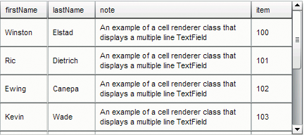

# Customize the DataGrid component

You can transform a DataGrid component horizontally and vertically during
authoring and run time. While authoring, select the component on the Stage and
use the Free Transform tool or any of the Modify \> Transform commands. At run
time, use the `setSize()` method or applicable properties, such as `width`,
`height`, `scaleX`, and `scaleY`. If there is no horizontal scroll bar, column
widths adjust proportionally. If column (and therefore, cell) size adjustment
occurs, text in the cells may be clipped.

## Use styles with the DataGrid component

You can set style properties to change the appearance of a DataGrid component.
The DataGrid component inherits styles from the List component. (See
[Use styles with the List component](./customize-the-list-component.md#use-skins-with-the-list-component).)

### Set styles for an individual column

A DataGrid object can have multiple columns and you can specify different cell
renderers for each column. Each column of a DataGrid is represented by a
DataGridColumn object and the DataGridColumn class includes a `cellRenderer`
property, for which you can define the CellRenderer for the column.

1.  Create a new Flash document (ActionScript 3.0).

2.  Drag the DataGrid component to the Library panel.

3.  Add the following code to the Actions panel on Frame 1 of the Timeline. This
    code creates a DataGrid with a long string of text in the third column. At
    the end, it sets the column's `cellRenderer` property to the name of a cell
    renderer that renders a multiline cell.

        /* This is a simple cell renderer example.It invokes
        the MultiLineCell cell renderer to display a multiple
        line text field in one of a DataGrid's columns. */

        import fl.controls.DataGrid;
        import fl.controls.dataGridClasses.DataGridColumn;
        import fl.data.DataProvider;
        import fl.controls.ScrollPolicy;

        // Create a new DataGrid component instance.
        var aDg:DataGrid = new DataGrid();

        var aLongString:String = "An example of a cell renderer class that displays a multiple line TextField"
        var myDP:Array = new Array();
        myDP = [
            {firstName:"Winston", lastName:"Elstad", note:aLongString, item:100},
            {firstName:"Ric", lastName:"Dietrich", note:aLongString, item:101},
            {firstName:"Ewing", lastName:"Canepa", note:aLongString, item:102},
            {firstName:"Kevin", lastName:"Wade", note:aLongString, item:103},
            {firstName:"Kimberly", lastName:"Dietrich", note:aLongString, item:104},
            {firstName:"AJ", lastName:"Bilow", note:aLongString, item:105},
            {firstName:"Chuck", lastName:"Yushan", note:aLongString, item:106},
            {firstName:"John", lastName:"Roo", note:aLongString, item:107},
        ];

        // Assign the data provider to the DataGrid to populate it.
        // Note: This has to be done before applying the cellRenderers.
        aDg.dataProvider = new DataProvider(myDP);

        /* Set some basic grid properties.
        Note: The data grid's row height should reflect
        the number of lines you expect to show in the multiline cell.
        The cell renderer wil size to the row height.
        About 40 for 2 lines or 60 for 3 lines.*/

        aDg.columns = ["firstName", "lastName", "note", "item"];
        aDg.setSize(430,190);
        aDg.move(40,40);
        aDg.rowHeight = 40;// Allows for 2 lines of text at default text size.
        aDg.columns[0].width = 70;
        aDg.columns[1].width = 70;
        aDg.columns[2].width = 230;
        aDg.columns[3].width = 60;
        aDg.resizableColumns = true;
        aDg.verticalScrollPolicy = ScrollPolicy.AUTO;
        addChild(aDg);
        // Assign cellRenderers.
        var col3:DataGridColumn = new DataGridColumn();
        col3 = aDg.getColumnAt(2);
        col3.cellRenderer = MultiLineCell;

4.  Save the FLA file as MultiLineGrid.fla.

5.  Create a new ActionScript file.

6.  Copy the following ActionScript code into the Script window:

        package {

            import fl.controls.listClasses.CellRenderer;

            public class MultiLineCell extends CellRenderer
            {

                public function MultiLineCell()
                {
                    textField.wordWrap = true;
                    textField.autoSize = "left";
                }

                override protected function drawLayout():void {
                    textField.width = this.width;
                    super.drawLayout();
                }

            }
        }

7.  Save the ActionScript file as MultiLineCell.as in the same folder where you
    saved the MultiLineGrid.fla.

8.  Return to the MultiLineGrid.fla application and select Control \> Test
    Movie.

    The DataGrid should look like this:

    

    <caption>DataGrid for the MultiLineGrid.fla application</caption>

### Set header styles

You can set the text style for a header row by using the `headerTextFormat`
style. The following example uses the TextFormat object to set the
`headerTextFormat` style to use the Arial font, the color red, a font size of
14, and italic.

1.  Create a new Flash file (ActionScript 3.0) document.

2.  Drag the DataGrid component to the Stage and give it an instance name of
    **aDg**.

3.  Open the Actions panel, select Frame 1 in the main Timeline and enter the
    following code:

        import fl.data.DataProvider;
        import fl.controls.dataGridClasses.DataGridColumn;

        var myDP:Array = new Array();
        myDP = [
            {FirstName:"Winston", LastName:"Elstad"},
            {FirstName:"Ric", LastName:"Dietrich"},
            {FirstName:"Ewing", LastName:"Canepa"},
            {FirstName:"Kevin", LastName:"Wade"},
            {FirstName:"Kimberly", LastName:"Dietrich"},
            {FirstName:"AJ", LastName:"Bilow"},
            {FirstName:"Chuck", LastName:"Yushan"},
            {FirstName:"John", LastName:"Roo"},
        ];

        // Assign the data provider to the DataGrid to populate it.
        // Note: This has to be done before applying the cellRenderers.
        aDg.dataProvider = new DataProvider(myDP);
        aDg.setSize(160,190);
        aDg.move(40,40);
        aDg.columns[0].width = 80;
        aDg.columns[1].width = 80;
        var tf:TextFormat = new TextFormat();
        tf.size = 14;
        tf.color = 0xff0000;
        tf.italic = true;
        tf.font = "Arial"
        aDg.setStyle("headerTextFormat", tf);

4.  Select Control \> Test Movie to run the application.

## Use skins with the DataGrid component

The DataGrid component uses the following skins to represent its visual states:

<caption>DataGrid skins</caption>

The CellRenderer skin is the skin used for the body cells of the DataGrid, while
the HeaderRenderer skin is used for the header row. The following procedure
changes the background color of the header row but you could use the same
process to change the background color of the DataGrid's body cells by editing
the CellRenderer skin.

1.  Create a new Flash document (ActionScript 3.0).

2.  Drag the DataGrid component to the Stage and give it an instance name of
    **aDg**.

3.  Double-click the component to open its palette of skins.

4.  Set the zoom control to 400% to enlarge the icons for editing.

5.  Double-click the HeaderRenderer skin to open the palette of HeaderRenderer
    skins.

6.  Double-click the Up_Skin to open it in symbol-editing mode and click its
    background until it is selected and the Fill color picker appears in the
    Property inspector.

7.  Select color \#00CC00 using the Fill color picker to apply it to the
    background of the Up_Skin HeaderRenderer skin.

8.  Click the Back button at the left side of the edit bar above the Stage to
    return to document-editing mode.

9.  Add the following code to the Actions panel on Frame 1 of the Timeline to
    add data to the DataGrid:

        import fl.data.DataProvider;

        bldRosterGrid(aDg);
        var aRoster:Array = new Array();
        aRoster = [
            {Name:"Wilma Carter",Home: "Redlands, CA"},
            {Name:"Sue Pennypacker",Home: "Athens, GA"},
            {Name:"Jill Smithfield",Home: "Spokane, WA"},
            {Name:"Shirley Goth", Home: "Carson, NV"},
            {Name:"Jennifer Dunbar",Home: "Seaside, CA"}
        ];
        aDg.dataProvider = new DataProvider(aRoster);
        function bldRosterGrid(dg:DataGrid) {
            dg.setSize(400, 130);
            dg.columns = ["Name", "Home"];
            dg.move(50,50);
            dg.columns[0].width = 120;
            dg.columns[1].width = 120;
        }

10. Select Control \> Test Movie to test the application.

    The DataGrid should appear as it does in the following illustration with the
    background of the header row in green.

    

    <caption>DataGrid with customized header row background</caption>
