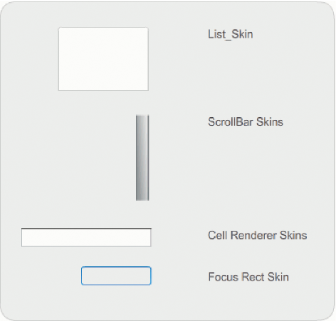
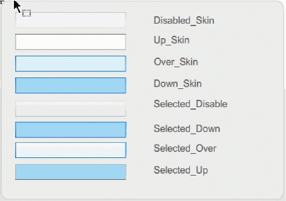
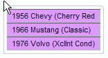

# Customize the List component

You can transform a List component horizontally and vertically while authoring
and at run time. While authoring, select the component on the Stage and use the
Free Transform tool or any of the Modify \> Transform commands. At run time, use
the `setSize()` method and applicable properties of the List class such as
`height`, `width`, `scaleX`, and `scaleY`.

When a list is resized, the rows of the list shrink horizontally, clipping any
text within them. Vertically, the list adds or removes rows as needed. Scroll
bars are positioned automatically as needed.

## Use styles with the List component

You can set style properties to change the appearance of a List component. The
styles specify values for the component's skins and padding when the component
is drawn.

The various skin styles allow you to specify different classes to use for the
skin. For more information on using skin styles, see
[About Skins](./about-skins.md).

The following procedure sets the value of the `contentPadding` style for the
List component. Notice that the value of this setting is subtracted from the
size of the List to achieve the padding around the content, so you might need to
increase the size of the List to prevent text in the List from being cropped.

1.  Create a new Flash file (ActionScript 3.0) document.

2.  Drag the List component from the Components panel to the Stage and give it
    an instance name of **aList**.

3.  Select Frame 1 in the main Timeline, open the Actions panel, and enter the
    following code, which sets the `contentPadding` style and adds data to the
    List:

        aList.setStyle("contentPadding", 5);
        aList.setSize(145, 200);
        aList.addItem({label:"1956 Chevy (Cherry Red)", data:35000});
        aList.addItem({label:"1966 Mustang (Classic)", data:27000});
        aList.addItem({label:"1976 Volvo (Xcllnt Cond)", data:17000});
        aList.rowCount = aList.length;

4.  Select Control \> Test Movie.

## Use skins with the List component

The List component uses the following skins to represent its visual states:

<caption>List skins</caption>

For more information about skinning the ScrollBar, see
[Customize the UIScrollBar component](./customize-the-uiscrollbar-component.md).
For information on skinning the Focus Rect skin, see
[Customize the TextArea component](./customize-the-textarea-component.md)

> **Note:** Changing the ScrollBar skin in one component will change it for all
> other components that use the ScrollBar.

Double-click the Cell Renderer skin to open a second palette of skins for the
different states of a List cell.

<caption>List Cell Renderer skins</caption>

You can change the appearance of the List's cells by editing these skins. The
following procedure changes the color of the Up skin to change the List's
appearance in its normal inactive state.

1.  Create a new Flash file (ActionScript 3.0) document.

2.  Drag the List component from the Components panel to the Stage and give it
    an instance name of **aList**.

3.  Double-click the List to open its palette of skins.

4.  Double-click the Cell Renderer skin to open the palette of Cell Renderer
    skins.

5.  Double-click the Up_Skin skin to open it for editing.

6.  Click the fill area of the skin to select it. A Fill color picker should
    appear in the Property inspector with the skin's current fill color.

7.  Select color \#CC66FF using the Fill color picker to apply it to the fill of
    the Up_Skin skin.

8.  Click the Back button at the left side of the edit bar above the Stage to
    return to document-editing mode.

9.  Add the following code to the Actions panel on Frame 1 of the Timeline to
    add data to the List:

        aList.setStyle("contentPadding", 5);
        aList.setSize(145, 200);
        aList.addItem({label:"1956 Chevy (Cherry Red)", data:35000});
        aList.addItem({label:"1966 Mustang (Classic)", data:27000});
        aList.addItem({label:"1976 Volvo (Xcllnt Cond)", data:17000});
        aList.rowCount = aList.length;

10. Select Control \> Test Movie.

    The List should display as it does in the following illustration:

    

    <caption>List cells with custom Up_Skin color</caption>

    The framing results from setting the `contentPadding` style.
