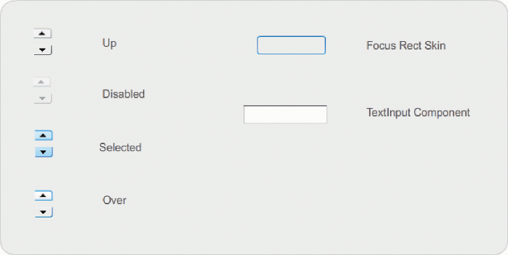
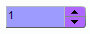

# Customize the NumericStepper component

You can transform a NumericStepper component horizontally and vertically while
authoring and at run time. While authoring, select the component on the Stage
and use the Free Transform tool or any of the Modify \> Transform commands. At
run time, use the `setSize()` method or any applicable properties and methods of
the NumericStepper class such as `width`, `height`, `scaleX`, and `scaleY`.

Resizing the NumericStepper component does not change the width of the down and
up arrow buttons. If the stepper is resized to be greater than the default
height, the default behavior pins the arrow buttons to the top and bottom of the
component. Otherwise, 9-slice scaling determines how the buttons are drawn. The
arrow buttons always appear to the right of the text box.

## Styles and the NumericStepper component

You can set the style properties of the NumericStepper component to change its
appearance. The styles specify values for the component's skins, padding, and
text format when the component is drawn. The `textFormat` style allows you to
change the size and appearance of the NumericStepper's value. The various skin
styles allow you to specify different classes to use for the skin. For more
information on using skin styles, see [About Skins](./about-skins.md).

This procedure uses the `textFormat` style to change the appearance of the value
that the NumericStepper displays.

1.  Create a new Flash document (ActionScript 3.0).

2.  Drag the NumericStepper component from the Component's panel to the Stage
    and give it an instance name of **myNs**.

3.  Add the following code to the Actions panel on Frame 1 of the main Timeline:

        var tf:TextFormat = new TextFormat();
        myNs.setSize(100, 50);
        tf.color = 0x0000CC;
        tf.size = 24;
        tf.font = "Arial";
        tf.align = "center";
        myNs.setStyle("textFormat", tf);

4.  Select Control \> Test Movie.

## Skins and the NumericStepper component

The NumericStepper component has skins to represent the up, down, disabled, and
selected states of its buttons.

If a stepper is enabled, the down and up buttons display their over states when
the pointer moves over them. The buttons display their down state when pressed.
The buttons return to their over state when the mouse is released. If the
pointer moves off the buttons while the mouse is pressed, the buttons return to
their original state.

If a stepper is disabled, it displays its disabled state, regardless of user
interaction.

A NumericStepper component has the following skins:

<caption>NumericStepper skins</caption>

1.  Create a new FLA file.

2.  Drag the NumericStepper component to the Stage.

3.  Set the Zoom control to 400% to enlarge the image for editing.

4.  Double-click the background of the TextInput skin on the skins panel until
    you drill down to the Group level and the background color appears in the
    Fill color picker in the Property inspector.

5.  Using the Fill color picker in the Property inspector, select color \#9999FF
    to apply it to the background of the TextInput skin.

6.  Click the Back button at the left side of the edit bar above the Stage to
    return to document-editing mode.

7.  Double-click the NumericStepper again to reopen the skins panel.

8.  Double-click the background of the up arrow button in the Up group until the
    background is selected and its color appears in the Fill color picker in the
    Property inspector.

9.  Select color \#9966FF to apply it to the background of the up arrow button.

10. Repeat steps 8 and 9 for the down arrow in the Up group.

11. Select Control \> Test Movie.

    The NumericStepper instance should appear as shown in the following
    illustration:

    
