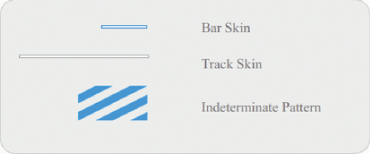
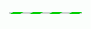

# Customize the ProgressBar component

You can transform a ProgressBar component horizontally and vertically while
authoring and at run time. While authoring, select the component on the Stage
and use the Free Transform tool or any of the Modify \> Transform commands. At
run time, use the `setSize()` method or the appropriate properties of the
ProgressBar class such as `height`, `width`, `scaleX`, and `scaleY`.

The ProgressBar has three skins: a track skin, a bar skin, and an indeterminate
skin. It uses 9-slice scaling to scale the assets.

## Styles and the ProgressBar component

You can set style properties to change the appearance of a ProgressBar instance.
The ProgressBar's styles specify values for its skin and padding when the
component is drawn. The following example enlarges the size of a ProgressBar
instance and sets its barPadding style.

1.  Create a new FLA file.

2.  Drag the ProgressBar component from the Components panel to the Stage and
    give it an instance name of **myPb.**

3.  On Frame 1 of the main Timeline, enter the following code in the Actions
    Panel:

        myPb.width = 300;
        myPb.height = 30;

        myPb.setStyle("barPadding", 3);

4.  Select Control \> Test Movie.

    For information on setting skin styles, see [About Skins](./about-skins.md).

## Skins and the ProgressBar component

The ProgressBar component uses skins to represent the progress bar track, the
completed bar, and an indeterminate bar as shown in the following illustration.

<caption>ProgressBar skins</caption>

The bar is placed over the track skin, using the barPadding to determine the
positioning. The assets are scaled using 9-slice scaling.

The indeterminate bar is used when the ProgressBar instance's `indeterminate`
property is set to `true`. The skin is resized vertically and horizontally to
fit the size of the ProgressBar.

You can edit these skins to change the appearance of the ProgressBar. For
example, the following example changes the color of the indeterminate bar.

1.  Create a new FLA file.

2.  Drag a ProgressBar component to the stage and double-click it to open its
    panel of skin icons.

3.  Double-click the indeterminate bar skin.

4.  Set the zoom control to 400% to enlarge the icon for editing.

5.  Double-click one of the diagonal bars, then hold down the Shift key and
    click on each of the others. The current color appears in the Fill color
    picker in the Property inspector.

6.  Click the Fill color picker in the Property inspector to open it and select
    color \#00CC00 to apply it to the selected diagonal bars.

7.  Click the Back button at the left side of the edit bar above the Stage to
    return to document-editing mode.

8.  Select Control \> Test Movie.

    The ProgressBar should appear as shown in the following illustration.

    
