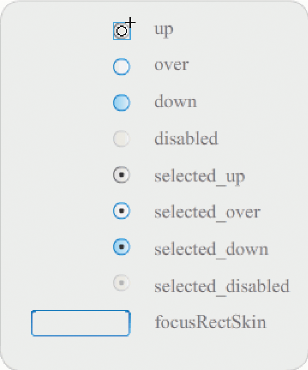
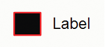

# Customize the RadioButton component

You can transform a RadioButton component horizontally and vertically while
authoring and at run time. While authoring, select the component on the Stage
and use the Free Transform tool or any of the Modify \> Transform commands. At
run time, use the `setSize()` method.

The bounding box of a RadioButton component is invisible and also designates the
hit area for the component. If you increase the size of the component, you also
increase the size of the hit area.

If the component's bounding box is too small to fit the component label, the
label is clipped to fit.

## Use styles with the RadioButton component

You can set style properties to change the appearance of a RadioButton. The
RadioButton's style properties specify values for its skins, icons, text
formatting, and padding when the component is drawn. The RadioButton's styles
specify values for its skins and padding for its layout when the component is
drawn.

The following example retrieves the `textFormat` style from a CheckBox component
and applies it to a RadioButton to make the style of their labels identical.

1.  Create a new Flash document (ActionScript 3.0).

2.  Drag a CheckBox component to the Stage and give it an instance name of
    **myCh** in the Property inspector.

3.  Drag a RadioButton to the Stage and give it an instance name of **myRb** in
    the Property inspector.

4.  Add the following code to the Actions panel on Frame 1 of the Timeline.

        var tf:TextFormat = new TextFormat();
        tf.color = 0x00FF00;
        tf.font = "Georgia";
        tf.size = 18;
        myCh.setStyle("textFormat", tf);
        myRb.setStyle("textFormat", myCh.getStyle("textFormat"));

    This code sets the `textFormat` style for the CheckBox, then applies it to
    the RadioButton by calling the `getStyle()` method on the CheckBox.

5.  Select Control \> Test Movie.

## Skins and the RadioButton component

The RadioButton has the following skins which you can edit to change its
appearance:

<caption>RadioButton skins</caption>

If a RadioButton is enabled and not selected, it displays its over skin when a
user moves the pointer over it. When a user clicks a RadioButton, it receives
input focus and displays its selected_down skin. When a user releases the mouse,
the RadioButton displays its selected_up skin. If a user moves the pointer out
of the RadioButton's hit area while pressing the mouse button, the RadioButton
redisplays its up skin.

If a RadioButton is disabled, it displays its disabled state, regardless of user
interaction.

The following example replaces the selected_up skin that indicates the selected
state.

1.  Create a new Flash document (ActionScript 3.0).

2.  Drag the RadioButton component to the Stage and double-click it to open its
    palette of skins.

3.  Set the zoom control to 800% to enlarge the icon for editing.

4.  Double-click the selected_up skin to select it and hit the Delete key to
    delete it.

5.  Select the Rectangle tool on the Tools panel.

6.  In the Property inspector, set the line color to red (#FF0000) and the Fill
    color to black (#000000).

7.  Starting at the cross hairs that mark the symbol's registration point (also
    _origin point_ or _zero point_), click and drag the pointer to draw a
    rectangle.

8.  Click the Back button at the left side of the edit bar above the Stage to
    return to document-editing mode.

9.  Select Control \> Test Movie.

10. Click the RadioButton to select it.

    The RadioButton in the selected state should appear similar to the one in
    the following illustration.

    
