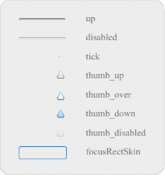

# Customize the Slider component

You can transform a Slider component horizontally while authoring and at run
time. While authoring, select the component on the Stage and use the Free
Transform tool or any of the Modify \> Transform commands. At run time, use the
`setSize()` method or any applicable properties of the Slider class, such as the
`width` and `scaleX` properties.

You can only make a slider longer. You cannot increase its height. Flash ignores
the `height` property and the height parameter of the `setSize()` method. You
can create a vertical slider and make it longer vertically, though.

## Styles and the Slider component

The Slider component's styles specify only the classes for its skins and a value
for `FocusRectPadding`, which specifies the number of pixels to use for padding
between the component's bounding box and its outside boundary. For more
information about using skin styles, see [About Skins](./about-skins.md).

## Skins and the Slider component

The Slider component uses the following skins, which you can edit to change its
appearance.

<caption>Slider skins</caption>

The following example edits the up track to change its color to blue.

1.  Create a new Flash document (ActionScript 3.0).

2.  Drag the Slider component from the Components panel to the Stage.

3.  Double-click the Slider component to open its skins panel.

4.  Double-click the up track on its registration mark to open it in
    symbol-editing mode.

5.  Set the zoom control to 800% to enlarge the icon for editing. Notice that
    the Slider's track consists of three bars.

6.  Click the top bar to select it. When it's selected, its color will appear in
    the Fill color picker in the Property inspector.

7.  Using the Fill color picker in the Property inspector, select color \#000066
    to apply it to the top bar of the Slider track.

8.  Click the middle bar of the Slider track to select it. When it's selected,
    its color appears in the Fill color picker in the Property inspector.

9.  Using the Fill color picker in the Property inspector, select color \#0066FF
    to apply it to the middle bar of the Slider track.

10. Click the bottom bar of the Slider track to select it. When it's selected,
    its color appears in the Fill color picker in the Property inspector.

11. Using the Fill color picker in the Property inspector, select color \#00CCFF
    to apply it to the bottom bar of the Slider track.

12. Click the Back button at the left side of the edit bar above the Stage to
    return to document-editing mode.

13. Select Control \> Test Movie.

    The Slider should appear as it does in the following illustration.

    
