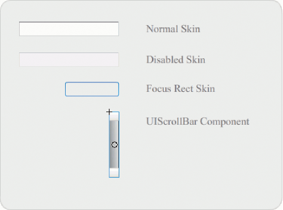
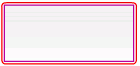

# Customize the TextArea component

You can transform a TextArea component horizontally and vertically while
authoring and at run time. While authoring, select the component on the Stage
and use the Free Transform tool or any of the Modify \> Transform commands. At
run time, use the `setSize()` method or any applicable properties, such as
`height`, `width`, `scaleX` and `scaleY` of the TextArea class.

When a TextArea component is resized, the border is resized to the new bounding
box. Scroll bars are placed on the bottom and right edges if they are required.
The text area is then resized within the remaining area; there are no fixed-size
elements in a TextArea component. If the width of the TextArea component is too
narrow to display the size of the text, the text is clipped.

## Styles and the TextArea component

The TextArea component's styles specify values for its skins, padding, and text
format when the component is drawn. The `texFormat` and `disabledTextFormat`
styles govern the style of the text that the TextArea displays. For more
information about skin style properties, see
[Use skins with the TextArea component](#use-skins-with-the-textarea-component).

The following example sets the `disabledTextFormat` style to change the
appearance of text when the TextArea is disabled but the same process applies to
setting the `textFormat` style for an enabled TextArea.

1.  Create a new Flash file.

2.  Drag a TextArea component to the Stage and give it an instance name of
    **myTa**.

3.  Add the following code to the Actions panel on Frame 1 of the main Timeline.

        var tf:TextFormat = new TextFormat();
        tf.color = 0xCC99FF;
        tf.font = "Arial Narrow";
        tf.size = 24;
        myTa.setStyle("disabledTextFormat", tf);
        myTa.text = "Hello World";
        myTa.setSize(120, 50);
        myTa.move(200, 50);
        myTa.enabled = false;

4.  Select Control \> Test Movie.

## Use skins with the TextArea component

The TextArea component uses the following skins, which you can edit to change
its appearance.

<caption>TextArea skins</caption>

Note: Changing the ScrollBar skin in one component will change it for all other
components that use the ScrollBar.

The following procedure changes the border colors of the Focus Rect Skin, which
appears when the TextArea has focus, and the Normal skin.

1.  Create a new Flash file.

2.  Drag a TextArea component to the stage and double-click it to open its panel
    of skin icons.

3.  Double-click the Focus Rect Skin.

4.  Click the border of the Focus Rect Skin to select it. When it's selected its
    current color appears in the Fill color picker in the Property inspector.

5.  Click the Fill color picker in the Property inspector to open it and select
    color \#CC0000 to apply it to the border.

6.  Click the Back button at the left side of the edit bar above the Stage to
    return to document-editing mode.

7.  Double-click the TextArea component to open its panel of skin icons.

8.  Double-click the Normal skin.

9.  Select each edge of the Normal skin's border, one at a time, and set its
    color to \#990099.

10. Click the Back button at the left side of the edit bar above the Stage to
    return to document-editing mode.

11. Select Control \> Test Movie.

    When you select the TextArea to begin entering text, its border should
    appear as shown in the following illustration:

    

    The outer border is the Focus Rect skin and the inner border is the border
    of the Normal skin.

    For information about editing the UIScrollBar skin see
    [Customize the UIScrollBar component](./customize-the-uiscrollbar-component.md).
