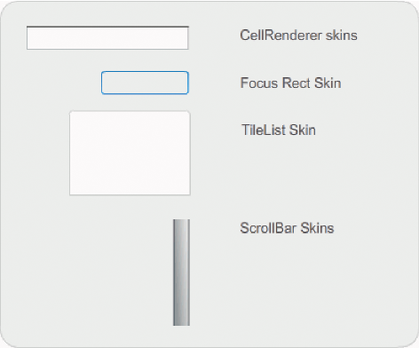
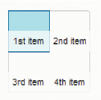

# Customize the TileList component

You can transform the TileList component horizontally and vertically while
authoring and at run time. While authoring, select the component on the Stage
and use the Free Transform tool or any of the Modify \> Transform commands. At
run time, use the `setSize()` method or the appropriate properties such as the
`width`, `height`, `columnCount`, `rowCount`, `scaleX`, and `scaleY`. The
ScrollBar, which TileList contains, scales with the list box.

## Styles and the TileList component

The TileList's styles specify values for its skins, padding, and text formatting
when the component is drawn. The `texFormat` and `disabledTextFormat` styles
govern the style of the text that displays in the component. For more
information about the skin styles, see
[Use skins with the TileList component](#use-skins-with-the-tilelist-component).

The following example calls the `setRendererStyle()` method using the
`textFormat` style to set the font, size, color, and text attributes of the
labels that display in a TileList instance. The same process applies also to
setting the `disabledTextFormat` style that is applied when the `enabled`
property is set to `false`.

1.  Create a new Flash document (ActionScript 3.0).

2.  Drag the TileList component to the Stage and give it an instance name of
    **myTl**.

3.  Add the following code to the Actions panel on Frame 1 of the Timeline.

        myTl.setSize(100, 100);
        myTl.addItem({label:"#1"});
        myTl.addItem({label:"#2"});
        myTl.addItem({label:"#3"});
        myTl.addItem({label:"#4"});
        var tf:TextFormat = new TextFormat();
        tf.font = "Arial";
        tf.color = 0x00FF00;
        tf.size = 16;
        tf.italic = true;
        tf.bold = true;
        tf.underline = true;
        tf.align = "center";
        myTl.setRendererStyle("textFormat", tf);

## Use skins with the TileList component

The TileList component has a TileList skin, a CellRenderer skin, and a ScrollBar
skin. You can edit these skins to change the TileList's appearance:

<caption>TileList skins</caption>

Note: Changing the ScrollBar skin in one component will change it in all other
components that use the ScrollBar.

The following procedure changes the color of the TileList's CellRenderer
Selected_Up skin.

1.  Create a Flash document (ActionScript 3.0).

2.  Drag the TileList component to the Stage and double-click it to open its
    panel of skins.

3.  Double-click the CellRenderer skin, then double-click the Selected_Up skin,
    and then click the rectangular background.

4.  Select color \#99FFFF using the Fill color picker in the Property inspector
    to apply it to the Selected_Up skin.

5.  Click the Back button at the left side of the edit bar above the Stage until
    you return to document-editing mode.

6.  On the Parameters tab of the Property inspector, double-click the second
    column of the dataProvider row to open the Values dialog box. Add items with
    the following labels: 1st item, 2nd item, 3rd item, 4th item.

7.  Select Control \> Test Movie.

8.  Click one of the cells in the TileList to select it, and then move the mouse
    away from the selected cell.

    The selected cell should appear as it does in the following illustration:

    

    <caption>TileList component with modfied Selected_Up skin color</caption>
