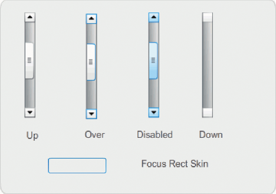
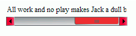

# Customize the UIScrollBar component

You can transform a UIScrollBar component horizontally and vertically while
authoring and at run time. However, a vertical UIScrollBar does not allow you to
modify the width, and a horizontal UIScrollBar does not allow you to modify the
height. While authoring, select the component on the Stage and use the Free
Transform tool or any of the Modify \> Transform commands. At run time, use the
`setSize()` method or any applicable properties of the UIScrollBar class such as
the `width`, `height`, `scaleX`, and `scaleY` properties.

> **Note:** If you use the `setSize()` method, you can change only the width of
> a horizontal scroll bar or the height of a vertical scroll bar. At the time of
> authoring you can set the height of a horizontal scroll bar or the width of a
> vertical scroll bar, but the values will be reset when the movie is published.
> Only the dimension of a scroll bar that corresponds to its length can be
> changed.

## Use styles with the UIScrollBar component

The UIScrollBar component's styles specify only the classes for its skins and a
value for FocusRectPadding, which specifies the number of pixels to use for
padding between the component's bounding box and its outside boundary. For more
information about using skin styles, see [About Skins](./about-skins.md).

## Use skins with the UIScrollBar component

The UIScrollBar component uses the following skins.

<caption>UIScrollBar skins</caption>

Both horizontal and vertical scroll bars use the same skins; when displaying a
horizontal scroll bar the UIScrollBar component rotates the skins as
appropriate.

> **Note:** Changing the ScrollBar skin in one component will change it in all
> other components that use the ScrollBar.

The following example demonstrates how to change the color of the UIScrollBar's
thumb and arrow buttons.

1.  Create a new Flash document (ActionScript 3.0).

2.  Drag the UIScrollBar component to the Stage and give it an instance name of
    **mySb**. In the Parameters tab, set the direction to horizontal.

3.  Double-click the scroll bar to open its panel of skins.

4.  Click the Up skin to select it.

5.  Set the zoom control to 400% to enlarge the icon for editing.

6.  Double-click the background of the right arrow (or up arrow for a vertical
    scroll bar) until the background is selected and its color appears in the
    Fill color picker in the Property inspector.

7.  Select color \#CC0033 to apply it to the button background.

8.  Click the Back button at the left side of the edit bar above the Stage until
    you return to document-editing mode.

9.  Repeat steps 6, 7, and 8 for the thumb and the left-hand arrow (or down
    arrow for a vertical scroll bar) elements.

10. Add the following code to the Actions panel on Frame 1 of the Timeline to
    attach the scroll bar to a TextField.

        var tf:TextField = new TextField();
        addChild(tf);
        tf.x = 150;
        tf.y = 100;
        mySb.width = tf.width = 200;
        tf.height = 22;
        tf.text = "All work and no play makes Jack a dull boy. All work and no play makes Jack a dull boy. All . . .";
        mySb.y = tf.y + tf.height;
        mySb.x = tf.x + tf.width;x
        mySb.scrollTarget = tf;

11. Select Control \> Test Movie.

    The UIScrollBar component should appear as it does in the following
    illustration.

    

    <caption>Horizontal ScrollBar with thumb and left and right arrows in red</caption>
