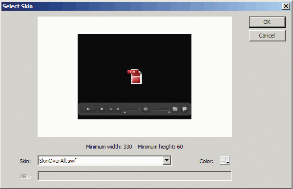
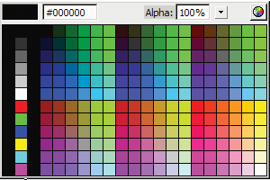

# Select a predesigned skin

You can select a skin for the FLVPlayback component by clicking the `value` cell
for the `skin` parameter in the Component inspector. Then click the magnifying
glass icon to open the following Select Skin dialog box, in which you can select
a skin or provide a URL that specifies the location of the skin SWF file.

<caption>FLVPlayback Select Skin dialog box</caption>

Skins that are listed in the Skin pop-up menu are located in the Flash
application folder /Flash Configuration/FLVPlayback Skins/ActionScript 3.0. You
can make new skins available to this dialog box by creating them and placing the
SWF file in the folder. The name appears in the pop-up menu with a .swf
extension. For more information about creating a skin set, see
[Create a new skin](./create-a-new-skin.md).

For skins that you assign by setting the `skin` property, either by setting the
skin parameter during authoring or with ActionScript at run time, you can assign
color and alpha (transparency) values independent of choosing the skin. To
assign color and alpha values during authoring, open the Color picker in the
Skin Select dialog box, as shown here.

<caption>Color picker in the Skin Select dialog box</caption>

To choose the color, click a swatch in the panel or enter its numeric value in
the text box. To choose the alpha value, use the slider or type a percentage in
the Alpha text box.

To assign color and alpha values during run time, set the `skinBackgroundColor`
and `skinBackgroundAlpha` properties. Set the `skinBackgroundColor` property to
a 0xRRGGBB (red, green, blue) value. Set the skinBackgroundAlpha property to a
number between 0.0 and 1.0. The following example sets `skinBackgroundColor` to
0xFF0000 (red) and skinBackgroundAlpha to .5.

    my_FLVPlybk.skinBackgroundColor = 0xFF0000;
    my_FLVPlybk.skinBackgroundAlpha = .5;

The default values are the last values chosen by the user.

If you want to skin the FLVPlayback component using the FLV Playback Custom UI
components, select None from the pop-up menu.
