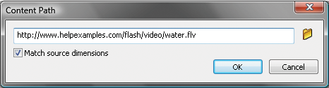

# FLVPlayback component parameters

For each instance of the FLVPlayback component, you can set the following
parameters in the Component inspector or the Property inspector: `align`,
`autoPlay`, `cuePoints`, `preview`, `scaleMode`, `skin`, `skinAutoHide`,
`skinBackgroundAlpha`, `skinBackgroundColor`, `source`, and `volume`. Each of
these parameters has a corresponding ActionScript property of the same name.
When you assign a value to these parameters you are setting the initial state of
the property in the application. Setting the property in ActionScript overrides
the value you set in the parameter. For information on the possible values for
these parameters, see the FLVPlayback class in the
_[ActionScript 3.0 Reference for the Adobe Flash Platform](https://help.adobe.com/en_US/FlashPlatform/reference/actionscript/3/index.html)_.

## Specify the FLVPlayback source parameter

The `source` parameter lets you specify the name and location of the video file,
both of which inform Flash how to play the file.

Open the Content Path dialog box by double-clicking the Value cell for the
`source` parameter in the Component inspector.

<caption>FLVPlayback Content Path dialog box</caption>

The Content Path dialog box provides a check box, Match Source FLV Dimensions,
that specifies whether the FLVPlayback instance on the Stage should match the
dimensions of the source video file. The source video file contains preferred
height and width dimensions for playing. If you select this option, the
dimensions of the FLVPlayback instance are resized to match these preferred
dimensions.

#### The source

Enter the URL or local path for either the video file or an XML file that
describes how to play the video file. If you do not know the exact location of a
video file, click the folder icon to open a Browser dialog box to help you find
the correct location. When browsing for a video file, if it is at or below the
location of the target SWF file, Flash automatically makes the path relative to
that location so you can serve it from a web server. Otherwise, the path is an
absolute Windows or Macintosh path. To enter the name of a local XML file, type
the path and name.

If you specify an HTTP URL, the video file plays as a progressive download. If
you specify a URL that is an RTMP URL, the video file streams from Flash Media
Server or FVSS. A URL to an XML file could also be a streaming video file from
Flash Media Server or FVSS.

Important:

You can also specify the location of a SMIL file that describes how to play
multiple video file streams for multiple bandwidths. The file uses the
Synchronized Multimedia Integration Language (SMIL) to describe the FLV files.
For a description of the SMIL file, see
[Use a SMIL file](../use-a-smil-file.md).

You can also specify the name and location of the video file using the
ActionScript `FLVPlayback`. `source` property and the `FLVPlayback.play()` and
`FLVPlayback.load()` methods. These three alternatives take precedence over the
`source` parameter in the Component inspector. For more information, see the
`FLVPlayback.source`, `FLVPlayback.play()`, and `FLVPlayback.load()` entries for
the FLVPlayback class in the
_[ActionScript 3.0 Reference for the Adobe Flash Platform](https://help.adobe.com/en_US/FlashPlatform/reference/actionscript/3/index.html)_.
