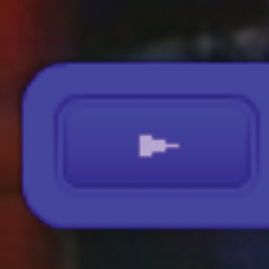

# Full-screen support

The ActionScript 3.0 version of the FLVPlayback component supports full-screen
mode, which requires Flash Player 9.0.28.0, or later, and also that the HTML is
set up correctly for full-screen viewing. Some predesigned skins include a
toggle button to switch full-screen mode on and off. The FullScreenButton icon
appears on the right side of the control bar in the following illustration.

<caption>Full-screen icon on control bar</caption>

Full-screen support occurs only if the `fullScreenTakeOver` property is set to
`true`, which it is by default.

Full-screen support can occur with or without hardware-acceleration support. For
information about hardware-acceleration support, see
[Hardware acceleration](#hardware-acceleration).

#### To implement full-screen support for FLVPlayback:

1.  Add the FLVPlayback component to your application and assign a video file to
    it.

2.  Select a skin for the FLVPlayback component that has the full-screen button
    (e.g., SkinUnderPlaySeekFullscreen.swf) or add the FullScreenButton
    user-interface component to the FLVPlayback component from the Video section
    in the Components panel.

3.  Select File \> Publish Settings.

4.  In the Publish Settings dialog, click the HTML tab.

5.  On the HTML tab, select Flash With Full Screen Support from the Template
    pop-up menu.

6.  Also on the HTML tab, select the Detect Flash Version check box and specify
    a version of 9.0.28 or later, depending on the version of Flash Player that
    you are using.

7.  Select the Formats tab and be sure that both the Flash (.swf) and HTML
    (.html) options are selected. You can replace the default file names.

8.  Click Publish and then click OK.

    As an alternative to step 7, you can click OK and then select File \>
    Publish Preview \> Default - (HTML) to automatically open the exported HTML
    file in your default browser. Otherwise, open the exported HTML file with
    your browser to test the full-screen option.

    To add the FLVPlayback component with full-screen support to your web page,
    open the exported HTML file and copy the code that embeds the SWF file into
    the HTML file for your web page. This code should look similar to the
    following example:

        //from the <head> section

        
        
        
        

        //and from the <body> section

        
        <noscript>
        // Provide alternative content for browsers that do not support scripting
        // or for those that have scripting disabled.
        Alternative HTML content should be placed here. This content requires Adobe Flash Player.
        <a href="http://www.macromedia.com/go/getflash/">Get Flash</a>
        </noscript>

    As an alternative, you can use the exported HTML file as the template for
    your web page and add your other content to it. If you do this, however,
    change the name of the HTML file so that you don't accidentally overwrite it
    in the event that you later export the FLVPlayback HTML file from Flash
    again.

    In any case, you must also upload to your web server the
    AC_RunActiveContent.js file that is exported to the same folder as the HTML
    file.

    ActionScript support for full-screen mode includes the
    `fullScreenBackgroundColor`, `fullScreenSkinDelay,` and `fullScreenTakeOver`
    properties and the `enterFullScreenDisplayState()` method. For information
    on these ActionScript elements, see the
    _[ActionScript 3.0 Reference for the Adobe Flash Platform](https://help.adobe.com/en_US/FlashPlatform/reference/actionscript/3/index.html)_
    .

## Use enterFullScreenDisplayState()

You can also invoke full-screen mode by calling the
`enterFullScreenDisplayState()` ActionScript method, as shown in the following
example.

    function handleClick(e:MouseEvent):void {
        myFLVPlybk.enterFullScreenDisplayState();
    }
    myButton.addEventListener(MouseEvent.CLICK, handleClick);

In this example, full-screen mode is _not_ invoked by clicking the full-screen
toggle button on an FLVPlayback skin, but rather, by clicking a button
(MyButton) that the creator of the web page included to invoke full-screen mode.
Clicking the button triggers the `handleClick` event handler, which calls the
`enterFullScreen DisplayState()` method.

The `enterFullScreenDisplayState()` method sets the `Stage.displayState`
property to `StageDisplayState.FULL_SCREEN`, and therefore carries the same
restrictions as the `displayState` property. For more information on the
`enterFullScreenDisplayState()` method and the `Stage`. `displayState` property,
see the
_[ActionScript 3.0 Reference for the Adobe Flash Platform](https://help.adobe.com/en_US/FlashPlatform/reference/actionscript/3/index.html)_.

## Hardware acceleration

Flash Player 9.0.115.0 and later versions include code that takes advantage of
available video hardware to improve the performance and fidelity of FLV files
that FLVPlayback plays in full-screen mode. If the prerequisites are met and the
`fullScreenTakeOver` property is set to `true`, Flash Player uses hardware
acceleration to scale the video file, rather than scaling it through software.
If the FLVPlayback component runs in an earlier version of Flash Player, or if
the prerequisites for hardware acceleration do not exist, Flash Player scales up
the video file itself, as it did previously.

To take advantage of hardware acceleration for full-screen support, your
computer must have a DirectX 7-compatible video card with 4 MB or more of VRAM
(video RAM). This hardware support is available in Windows 2000 or Mac OS X
10.2, and later versions of those operating systems. Direct X® provides APIs
that comprise an interface between software and the video hardware to accelerate
three-dimensional and two-dimensional graphics, among other things.

To take advantage of hardware-acceleration mode, you must also invoke
full-screen mode in one of the following ways:

- Using the full-screen toggle button on an FLVPlayback skin

- Using the FullScreenButton video control

- Using the ActionScript `enterFullScreenDisplayState()` method. For more
  information, see
  [Use enterFullScreenDisplayState()](#use-enterfullscreendisplaystate).

  If you invoke full-screen mode by setting the `Stage.displayState` property to
  `StageDisplayState.FULLSCREEN`, FLVPlayback does not use hardware
  acceleration, even if the video hardware and memory are available.

  One consequence of using hardware acceleration for full-screen support is that
  the FLVPlayback skins are scaled along with the video player and the video
  file. The following image shows the effect of full-screen mode with hardware
  acceleration on the FLVPlayback skin, a detail of which is shown here at full
  resolution.

  

  <caption>Full-screen mode on a 1600 x 1200 monitor with a 320x240 pixel video</caption>

  This image shows the result of using full-screen mode on a 1600 x 1200 monitor
  with a video file that has a width of 320 and a height of 240, which are the
  default FLVPlayback dimensions. The distortion effect on the skin is more
  pronounced on FLV files with smaller dimensions or on a larger monitor.
  Conversely, the distortion effect is less pronounced on larger FLV files or on
  smaller monitors. For example, changing from 640 x 480 to 1600 x 1200 still
  increases the size of the skin, but it looks less distorted.

  You can set the `skinScaleMaximum` property to limit the scaling of the
  FLVPlayback skin. The default value is 4.0, or 400%. Limiting the scaling of
  the skin, however, requires a combination of hardware and software to scale
  the FLV and this can adversely affect performance on FLVs with large
  dimensions that are encoded at a high bit rate. If the video is large (640
  pixels wide or more, 480 pixels tall or more, for example), you should not set
  `skinScaleMaximum` to a small value because it could cause large performance
  problems on large display monitors. The `skinScaleMaximum` property allows you
  to manage the trade offs between performance and quality and the appearance of
  a large skin.

## Exit full-screen mode

To exit full-screen mode, click the full-screen button again or press the Esc
key.

Setting the following properties and calling the following methods can cause
layout changes that cause the FLVPLayback component to exit full-screen mode:
`height`, `registrationHeight`, `registrationWidth`, `registrationX`,
`registrationY`, `scaleX`, `scaleY`, `width`, `x`, `y`, `setScale()`,or
`setSize()`.

If you set the `align` or `scaleMode` properties, FLVPlayback sets them to
`center` and `maintainAspectRatio` until full-screen mode is exited.

Changing the value of the `fullScreenTakeOver` property from `true` to `false`
when you are using full-screen, hardware-acceleration mode also causes Flash to
exit full-screen mode.
