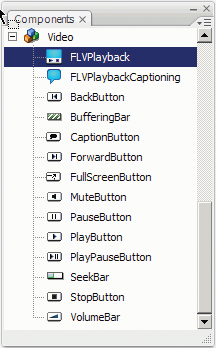

# Use the FLVPlayback component

Using the FLVPlayback component consists of putting it on the Stage and
specifying a video file for it to play. In addition, you can also set various
parameters that govern its behavior and describe the video file.

The FLVPlayback component also includes an ActionScript application programming
interface (API). The API includes the following classes, which are fully
described in the
_[ActionScript 3.0 Reference for the Adobe Flash Platform](https://help.adobe.com/en_US/FlashPlatform/reference/actionscript/3/index.html)_:
CuePointType, FLVPlayback, FLVPlaybackCaptioning, NCManager, NCManagerNative,
VideoAlign, VideoError, VideoPlayer, VideoState, and several event classes -
AutoLayoutEvent, LayoutEvent, MetadataEvent, SkinErrorEvent, SoundEvent,
VideoEvent, and VideoProgressEvent.

The FLVPlayback component includes the FLV Playback Custom UI components. The
FLVPlayback component is a combination of the display area, or video player, in
which you view the video file and the controls that allow you to operate it. The
FLV Playback Custom UI components provide control buttons and mechanisms that
you can use to play, stop, pause, and otherwise control the video file. These
controls include the BackButton, BufferingBar, CaptionButton (for
FLVPlaybackCaptioning), ForwardButton, FullScreenButton, MuteButton,
PauseButton, PlayButton, PlayPauseButton, SeekBar, StopButton, and VolumeBar.
The FLVPlayback component and the FLV Playback Custom UI controls appear in the
Components panel, as shown in the following figure:

<caption>FLVPlayback components in the Components panel</caption>

The process of adding playback controls to the FLVPlayback component is called
_skinning_. The FLVPlayback component has an initial default skin,
SkinOverAll.swf, that provides the play, stop, back, forward, seekbar, mute,
volume, full screen, and captioning controls. To change this skin, you have the
following choices:

- Select from a collection of predesigned skins

- Create a custom skin and add it to the collection of predesigned skins

- Select individual controls from the FLV Playback Custom UI components and
  customize them

  When you select a predesigned skin, you can choose the skin color and alpha
  values separately, either during authoring or at run time. For more
  information, see
  [Select a predesigned skin](../customize-the-flvplayback-component/select-a-predesigned-skin.md).

  After you select a different skin, the selected skin becomes the new default
  skin.

  For more information about selecting or creating a skin for the FLVPlayback
  component, see
  [Customize the FLVPlayback component](../customize-the-flvplayback-component/index.md).

- [Create an application with the FLVPlayback component](./create-an-application-with-the-flvplayback-component.md)
- [FLVPlayback component parameters](./flvplayback-component-parameters.md)
- [Full-screen support](./full-screen-support.md)
- [Layout alignment for playing multiple video files](./layout-alignment-for-playing-multiple-video-files.md)
- [Automatic playing of progressively downloaded video files](./automatic-playing-of-progressively-downloaded-video-files.md)
- [Use cue points](./use-cue-points.md)
- [Play multiple video files](./play-multiple-video-files.md)
- [Stream FLV files from Flash Media Server](./stream-flv-files-from-flash-media-server.md)
