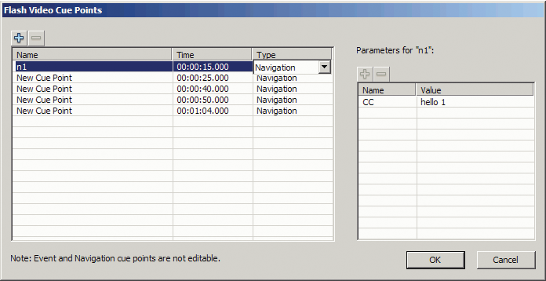

# Use cue points

A cue point is a point at which the video player dispatches a `cuePoint` event
while a video file plays. You can add cue points to an FLV file at times that
you want an action to occur for another element on the web page. You might want
to display text or a graphic, for example, or synchronize with a Flash
animation, or affect the playing of the FLV file by pausing it, seeking a
different point in the video, or switching to a different FLV file. Cue points
allow you to receive control in your ActionScript code to synchronize points in
your FLV file with other actions on the web page.

There are three types of cue points: navigation, event, and ActionScript. The
navigation and event cue points are also known as _embedded_ cue points because
they are embedded in the FLV file stream and in the FLV file's metadata packet.

A _navigation cue point_ allows you to seek a particular frame in the FLV file
because it creates a keyframe within the FLV file as near as possible to the
time that you specify. A _keyframe_ is a data segment that occurs between image
frames in the FLV file stream. When you seek a navigation cue point, the
component seeks to the keyframe and starts the `cuePoint` event.

An _event cue point_ enables you to synchronize a point in time within the FLV
file with an external event on the web page. The `cuePoint` event occurs
precisely at the specified time. You can embed navigation and event cue points
in an FLV file using either the Video Import wizard or the Adobe Media Encoder.
For more information on the Video Import wizard and the Adobe Media Encoder, see
"Working with Video," in _Using Flash_.

An _ActionScript cue point_ is an external cue point that you can add either
through the component's Flash Video Cue Points dialog box or through the
`FLVPlayback.addASCuePoint()` method. The component stores and tracks
ActionScript cue points apart from the FLV file, and consequently, they are less
accurate than embedded cue points. ActionScript cue points are accurate to a
tenth of a second. You can increase the accuracy of ActionScript cue points by
lowering the value of the `playheadUpdateInterval` property because the
component generates the `cuePoint` event for ActionScript cue points when the
playhead updates. For more information, see the
FLVPlayback.playheadUpdateInterval property in the
_[ActionScript 3.0 Reference for the Adobe Flash Platform](https://help.adobe.com/en_US/FlashPlatform/reference/actionscript/3/index.html)_.

In ActionScript and within the FLV file's metadata, a cue point is represented
as an object with the following properties: `name`, `time`, `type`, and
`parameters`. The `name` property is a string that contains the assigned name of
the cue point. The `time` property is a number representing the time in hours,
minutes, seconds, and milliseconds (HH:MM:SS.mmm) when the cue point occurs. The
`type` property is a string whose value is `"navigation"`, `"event"`, or
`"actionscript"`, depending on the type of cue point that you created. The
`parameters` property is an array of specified name and value pairs.

When a `cuePoint` event occurs, the cue point object is available in the event
object through the `info` property.

## Use the Flash Video Cue Points dialog box

In Flash Professional CS5, click the value cell of the `cuePoints` parameter in
the Component inspector for the FLVPlayback component. The Cue Points dialog box
appears at the bottom of the Property inspector.

In Flash Professional CS4, open the Flash Video Cue Points dialog box by
double-clicking the value cell of the `cuePoints` parameter in the Component
inspector.

The dialog box looks like the following figure:

<caption>Cue Points dialog box</caption>

The dialog box displays embedded and ActionScript cue points. You can use this
dialog box to add and delete ActionScript cue points as well as cue point
parameters. You can also enable or disable embedded cue points. However, you
cannot add, change, or delete embedded cue points.

#### Add an ActionScript cue point:

1.  Click the Value cell of the `cuePoints` parameter in the Component
    parameters to open the Cue Points dialog at the bottom of the Property
    inspector. (In Flash Professional CS4, double-click the value cell of the
    `cuePoints` parameter in the Component inspector to open the Flash Cue
    Points dialog box.)

2.  Click the plus (+) sign in the upper-left corner, above the list of cue
    points, to add a default ActionScript cue point entry.

3.  Click the New Cue Point text in the Name column, and edit the text to name
    the cue point.

4.  Click the Time value of 00:00:00:000 to edit it, and assign a time for the
    cue point to occur. You can specify the time in hours, minutes, seconds, and
    milliseconds (HH:MM:SS.mmm).

    If multiple cue points exist, the dialog box moves the new cue point to its
    chronological position in the list.

5.  To add a parameter for the selected cue point, click the plus (+) sign above
    the Parameters section, and enter values in the Name and Value columns.
    Repeat this step for each parameter.

6.  To add more ActionScript cue points, repeat steps 2 through 5 for each one.

7.  Press Enter to save your changes. (In Flash Professional CS4, Click OK to
    save your changes.)

#### Delete an ActionScript cue point:

1.  Click the value cell of the `cuePoints` parameter. (In Flash Professional
    CS4, double-click the Value cell of the `cuePoints` parameter in the
    Component inspector to open the Flash Cue Points dialog box.)

2.  Select the cue point that you want to delete.

3.  Click the minus (-) sign in the upper-left corner, above the list of cue
    points, to delete it.

4.  Repeat steps 2 and 3 for each cue point that you want to delete.

5.  Press Enter to save your changes. (In Flash Professional CS4, Click OK to
    save your changes.)

#### To enable or disable an embedded FLV file cue point:

1.  Click the value cell of the `cuePoints` parameter. (In Flash Professional
    CS4, double-click the value cell of the `cuePoints` parameter in the
    Component inspector to open the Flash Cue Points dialog box.)

2.  Select the cue point you want to enable or disable.

3.  Click the value in the Type column to trigger the pop-up menu, or click the
    down arrow.

4.  Click the name of the type of cue point (for example, Event or Navigation)
    to enable it. Click Disabled to disable it.

5.  Press Enter to save your changes. (In Flash Professional CS4, Click OK to
    save your changes.)

## Use cue points with ActionScript

You can use ActionScript to add ActionScript cue points, listen for `cuePoint`
events, find cue points of any type or a specific type, seek a navigation cue
point, enable or disable a cue point, check whether a cue point is enabled, and
remove a cue point.

The examples in this section use an FLV file called
[`cuepoints.flv`](../../img/helpexamples/cuepoints.flv), which contains the
following three cue points:

| Name   | Time         | Type       |
| ------ | ------------ | ---------- |
| point1 | 00:00:00.418 | Navigation |
| point2 | 00:00:07.748 | Navigation |
| point3 | 00:00:16.020 | Navigation |

#### Add ActionScript cue points

You can add ActionScript cue points to an FLV file using the `addASCuePoint()`
method. The following example adds two ActionScript cue points to the FLV file
when it is ready to play. It adds the first cue point using a cue point object,
which specifies the time, name, and type of the cue point in its properties. The
second call specifies the time and name using the method's `time` and `name`
parameters.

    // Requires an FLVPlayback instance called my_FLVPlybk on Stage
    import fl.video.*;
    import fl.video.MetadataEvent;
    my_FLVPlybk.source = "http://www.example.com/cuepoints.flv"
    var cuePt:Object = new Object(); //create cue point object
    cuePt.time = 2.02;
    cuePt.name = "ASpt1";
    cuePt.type = "actionscript";
    my_FLVPlybk.addASCuePoint(cuePt);//add AS cue point
    // add 2nd AS cue point using time and name parameters
    my_FLVPlybk.addASCuePoint(5, "ASpt2");

For more information, see the FLVPlayback.addASCuePoint() method in the
_[ActionScript 3.0 Reference for the Adobe Flash Platform](https://help.adobe.com/en_US/FlashPlatform/reference/actionscript/3/index.html)_.

#### Listen for cuePoint events

The `cuePoint` event allows you to receive control in your ActionScript code
when a `cuePoint` event occurs. When cue points occur in the following example,
the `cuePoint` listener calls an event handler function that displays the value
of the `playheadTime` property and the name and type of the cue point. Use this
example in combination with the example in the preceding section, Add
ActionScript cue points, to see the results.

    my_FLVPlybk.addEventListener(MetadataEvent.CUE_POINT, cp_listener);
    function cp_listener(eventObject:MetadataEvent):void {
        trace("Elapsed time in seconds: " + my_FLVPlybk.playheadTime);
        trace("Cue point name is: " + eventObject.info.name);
        trace("Cue point type is: " + eventObject.info.type);
    }

For more information on the `cuePoint` event, see the FLVPlayback.cuePoint event
in the
_[ActionScript 3.0 Reference for the Adobe Flash Platform](https://help.adobe.com/en_US/FlashPlatform/reference/actionscript/3/index.html)_.

#### Find cue points

Using ActionScript, you can find a cue point of any type, find the nearest cue
point to a time, or find the next cue point with a specific name.

The `ready_listener()` event handler in the following example calls the
`findCuePoint()` method to find the cue point `ASpt1` and then calls the
`findNearestCuePoint()` method to find the navigation cue point that is nearest
to the time of cue point `ASpt1`:

    import fl.video.FLVPlayback;
    import fl.video.CuePointType;
    import fl.video.VideoEvent;
    my_FLVPlybk.source = "http://www.example.com/cuepoints.flv"
    var rtn_obj:Object; //create cue point object
    my_FLVPlybk.addASCuePoint(2.02, "ASpt1");//add AS cue point
    function ready_listener(eventObject:VideoEvent):void {
        rtn_obj = my_FLVPlybk.findCuePoint("ASpt1", CuePointType.ACTIONSCRIPT);
        traceit(rtn_obj);
        rtn_obj = my_FLVPlybk.findNearestCuePoint(rtn_obj.time, CuePointType.NAVIGATION);
        traceit(rtn_obj);
    }
    my_FLVPlybk.addEventListener(VideoEvent.READY, ready_listener);
    function traceit(cuePoint:Object):void {
        trace("Cue point name is: " + cuePoint.name);
        trace("Cue point time is: " + cuePoint.time);
        trace("Cue point type is: " + cuePoint.type);
    }

In the following example, the `ready_listener()` event handler finds cue point
`ASpt` and calls the `findNextCuePointWithName()` method to find the next cue
point with the same name:

    import fl.video.*;
    my_FLVPlybk.source = "http://www.example.com/cuepoints.flv"
    var rtn_obj:Object; //create cue point object
    my_FLVPlybk.addASCuePoint(2.02, "ASpt");//add AS cue point
    my_FLVPlybk.addASCuePoint(3.4, "ASpt");//add 2nd Aspt
    my_FLVPlybk.addEventListener(VideoEvent.READY, ready_listener);
    function ready_listener(eventObject:VideoEvent):void {
        rtn_obj = my_FLVPlybk.findCuePoint("ASpt", CuePointType.ACTIONSCRIPT);
        traceit(rtn_obj);
        rtn_obj = my_FLVPlybk.findNextCuePointWithName(rtn_obj);
        traceit(rtn_obj);
    }
    function traceit(cuePoint:Object):void {
        trace("Cue point name is: " + cuePoint.name);
        trace("Cue point time is: " + cuePoint.time);
        trace("Cue point type is: " + cuePoint.type);
    }

For more information about finding cue points, see the
FLVPlayback.findCuePoint(), FLVPlayback.findNearestCuePoint(), and
FLVPlayback.findNextCuePointWithName() methods in the
_[ActionScript 3.0 Reference for the Adobe Flash Platform](https://help.adobe.com/en_US/FlashPlatform/reference/actionscript/3/index.html)_.

#### Seek navigation cue points

You can seek a navigation cue point, seek the next navigation cue point from a
specified time, and seek the previous navigation cue point from a specified
time. The following example plays the FLV file cuepoints.flv and seeks the cue
point at 7.748 when the `ready` event occurs. When the `cuePoint` event occurs,
the example calls the `seekToPrevNavCuePoint()` method to seek the first cue
point. When that `cuePoint` event occurs, the example calls the
`seekToNextNavCuePoint()` method to seek the last cue point by adding 10 seconds
to `eventObject.info.time`, which is the time of the current cue point.

    import fl.video.*;

    my_FLVPlybk.addEventListener(VideoEvent.READY, ready_listener);
    function ready_listener(eventObject:Object):void {
        my_FLVPlybk.seekToNavCuePoint("point2");
    }
    my_FLVPlybk.addEventListener(MetadataEvent.CUE_POINT, cp_listener);
    function cp_listener(eventObject:MetadataEvent):void {
        trace(eventObject.info.time);
        if(eventObject.info.time == 7.748)
            my_FLVPlybk.seekToPrevNavCuePoint(eventObject.info.time - .005);
        else
            my_FLVPlybk.seekToNextNavCuePoint(eventObject.info.time + 10);
    }
    my_FLVPlybk.source = "http://www.example.com/cuepoints.flv";

For more information, see the FLVPlayback.seekToNavCuePoint(),
FLVPlayback.seekToNextNavCuePoint(), and FLVPlayback.seekToPrevNavCuePoint()
methods in the
_[ActionScript 3.0 Reference](https://help.adobe.com/en_US/FlashPlatform/reference/actionscript/3/index.html)_.

#### Enable and disable embedded FLV file cue points

You can enable and disable embedded FLV file cue points using the
`setFLVCuePointEnabled()` method. Disabled cue points do not trigger `cuePoint`
events and do not work with the `seekToCuePoint()`, `seekToNextNavCuePoint()`,
or `seekToPrevNavCuePoint()` methods. You can find disabled cue points, however,
with the `findCuePoint()`, `findNearestCuePoint()`, and
`findNextCuePointWithName()` methods.

You can test whether an embedded FLV file cue point is enabled using the
`isFLVCuePointEnabled()` method. The following example disables the embedded cue
points `point2` and `point3` when the video is ready to play. When the first
`cuePoint` event occurs, however, the event handler tests to see whether cue
point `point3` is disabled and, if so, enables it.

    import fl.video.*;
    my_FLVPlybk.source = "http://www.example.com/cuepoints.flv";
    my_FLVPlybk.addEventListener(VideoEvent.READY, ready_listener);
    function ready_listener(eventObject:VideoEvent):void {
        my_FLVPlybk.setFLVCuePointEnabled(false, "point2");
        my_FLVPlybk.setFLVCuePointEnabled(false, "point3");
    }
    my_FLVPlybk.addEventListener(MetadataEvent.CUE_POINT, cp_listener);
    function cp_listener(eventObject:MetadataEvent):void {
        trace("Cue point time is: " + eventObject.info.time);
        trace("Cue point name is: " + eventObject.info.name);
        trace("Cue point type is: " + eventObject.info.type);
        if (my_FLVPlybk.isFLVCuePointEnabled("point2") == false) {
            my_FLVPlybk.setFLVCuePointEnabled(true, "point2");
        }
    }

For more information, see the FLVPlayback.isFLVCuePointEnabled() and
FLVPlayback.setFLVCuePointEnabled() methods in the
_[ActionScript 3.0 Reference for the Adobe Flash Platform](https://help.adobe.com/en_US/FlashPlatform/reference/actionscript/3/index.html)_.

#### Remove an ActionScript cue point

You can remove an ActionScript cue point using the `removeASCuePoint()` method.
The following example removes the cue point `ASpt2` when cue point `ASpt1`
occurs:

    import fl.video.*;
    my_FLVPlybk.source = "http://www.example.com/cuepoints.flv"
    my_FLVPlybk.addASCuePoint(2.02, "ASpt1");//add AS cue point
    my_FLVPlybk.addASCuePoint(3.4, "ASpt2");//add 2nd Aspt
    my_FLVPlybk.addEventListener(MetadataEvent.CUE_POINT, cp_listener);
    function cp_listener(eventObject:MetadataEvent):void {
        trace("Cue point name is: " + eventObject.info.name);
        if (eventObject.info.name == "ASpt1") {
            my_FLVPlybk.removeASCuePoint("ASpt2");
            trace("Removed cue point ASpt2");
        }
    }

For more information, see FLVPlayback.removeASCuePoint() in the
_[ActionScript 3.0 Reference for the Adobe Flash Platform](https://help.adobe.com/en_US/FlashPlatform/reference/actionscript/3/index.html)_.
