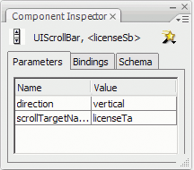

# Set parameters and properties

Each component has parameters that you can set to change its appearance and
behavior. A parameter is a property of the component's class and appears in the
Property inspector and the Component inspector. The most commonly used
properties appear as authoring parameters; others you must set with
ActionScript. All parameters that can be set during authoring can also be set
with ActionScript. Setting a parameter with ActionScript overrides any value set
during authoring.

Most ActionScript 3.0 User Interface components inherit properties and methods
from the UIComponent class as well as from a base class. For example, the Button
and CheckBox classes inherit properties from both the UIComponent class and the
BaseButton class. A component's inherited properties, as well as its own class
properties, are available for you to access. For example, the ProgressBar
component inherits the `ProgressBar.enabled` property from UIComponent but also
has its own `ProgressBar.percentComplete` property. You can access both of these
properties to interact with an instance of the ProgressBar component. For more
information on a component's properties, see its class entry in the
[ActionScript 3.0 Reference for the Adobe Flash Platform](https://help.adobe.com/en_US/FlashPlatform/reference/actionscript/3/index.html)
_._

You can set parameters for a component instance using either the Property
inspector or the Component inspector.

#### Enter an instance name for a component in the Property inspector:

1.  Select Window \> Properties \> Properties.

2.  Select an instance of a component on the Stage.

3.  Enter a name for the component instance in the box that says \<Instance
    Name\>, located beneath the drop-down list that says Movie Clip. Or click
    the Parameters tab and enter the name in the box below the word _Component_
    . Enter values for any parameters that you want to set.

    It's a good idea to add a suffix to the instance name to indicate what kind
    of component it is; this makes it easier to read your ActionScript code. For
    example, the instance name **licenseSb** identifies that a component is a
    scroll bar that scrolls a license agreement in the **licenseTa** text area.

#### Enter parameters for a component instance in the Component inspector:

1.  Select Window \> Component Inspector.

2.  Select an instance of a component on the Stage.

3.  Click the Parameters tab and enter values for any of the listed parameters.

    

    <caption>Component parameters in the Component inspector</caption>

## Set component properties in ActionScript

In ActionScript, you use a dot (.) operator (dot syntax) to access properties or
methods that belong to an object or instance on the Stage. A dot syntax
expression begins with the name of the instance, followed by a dot, and it ends
with the element you want to specify. For example, the following ActionScript
code sets the `width` property of the CheckBox instance `aCh` to make it 50
pixels wide:

    aCh.width = 50;

The following `if` statement checks to see if the user has selected the check
box:

    if (aCh.selected == true) {
        displayImg(redCar);
    }
