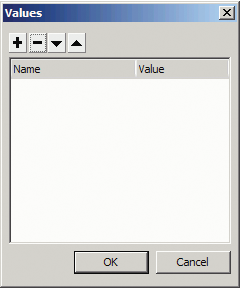
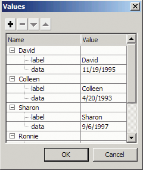
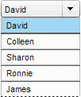
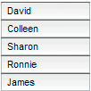
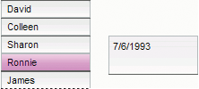

# Work with a DataProvider

A DataProvider is a data source that you can use to supply data to the ComboBox,
DataGrid, List, and TileList components. Each of these component classes has a
`dataProvider` property to which you can assign a DataProvider object to
populate the component's cells with data. Typically, a data provider is a
collection of data such as an Array or XML object.

## Create a DataProvider

For the ComboBox, List, and TileList components you can create a DataProvider
using the `dataProvider` parameter in the authoring environment. The DataGrid
component does not have a dataProvider parameter in the Property inspector
because it can have several columns and its data provider is consequently more
complex. You can also use ActionScript to create a DataProvider for these
components, as well as for the DataGrid.

### Use the dataProvider parameter

You can create a simple data provider for the ComboBox, List, and TileList
components by clicking the dataProvider parameter on the Parameters tab of the
Property inspector or the Component inspector.

If you double-click the value cell, which initially shows an empty Array, you
will open the Values dialog box, which allows you to enter multiple label and
data values to create the data provider.

<caption>Values dialog box for dataProvider</caption>

Click the plus sign to add an item to the dataProvider. Click the minus sign to
delete an item. Click the up arrow to move a selected item up in the list or
click the down arrow to move a selected item down in the list. The following
illustration shows a Values dialog box that creates a list of children's names
and their birthdays.

<caption>Values dialog box with data</caption>

The Array you create consists of pairs of label and value fields. The label
fields are `label` and `data` and the value fields are the children's names and
their birthdays. The label field identifies the content that appears in the
List, which in this case is the names of the children. The resulting ComboBox
looks like this:

<caption>The ComboBox populated by the DataProvider</caption>

When you finish adding data, click OK to close the dialog box. The Array in the
dataProvider parameter is now populated with the items that you created.

<caption>dataProvider parameter with data</caption>

You can access the label and data values that you created by using ActionScript
to access the component's `dataProvider` property.

### Create a DataProvider using ActionScript

You can create a DataProvider by creating the data in an Array or XML object and
providing the object as the `value` parameter to the DataProvider constructor.

> **Note:** In ActionScript 3.0, you cannot assign an Array or XML object
> directly to a dataProvider property because the property is defined as a
> DataProvider object and can only receive an object of the DataProvider type.

The following example populates a List component, which is a single column of
rows, with the names of several children and their birthdays. The example
defines the list in the `items` Array and supplies it as the parameter when it
creates the DataProvider instance ( `new DataProvider(items)`) and assigns it to
the `dataProvider` property of the List component.

    import fl.controls.List;
    import fl.data.DataProvider;

    var aList:List = new List();
    var items:Array = [
        {label:"David", data:"11/19/1995"},
        {label:"Colleen", data:"4/20/1993"},
        {label:"Sharon", data:"9/06/1997"},
        {label:"Ronnie", data:"7/6/1993"},
        {label:"James", data:"2/15/1994"},
    ];
    aList.dataProvider = new DataProvider(items);
    addChild(aList);
    aList.move(150,150);

The Array consists of pairs of label and value fields. The label fields are
`label` and `data` and the value fields are the children's names and their
birthdays. The label field identifies the content that appears in the List,
which in this case is the names of the children. The resulting List looks like
this:

<caption>A List populated by a DataProvider</caption>

The value of the data field is available when the user selects an item in the
list by clicking it and causing a `change` event. The following example adds a
TextArea ( `aTa`) and an event handler ( `changeHandler`) to the preceding
example to display the child's birthday when a user selects a name in the List.

    import fl.controls.List;
    import fl.controls.TextArea;
    import flash.events.Event;
    import fl.data.DataProvider;

    var aList:List = new List();
    var aTa:TextArea = new TextArea();
    var items:Array = [
        {label:"David", data:"1/19/1995"},
        {label:"Colleen", data:"4/20/1993"},
        {label:"Sharon", data:"9/06/1994"},
        {label:"Ronnie", data:"7/6/1993"},
        {label:"James", data:"2/15/1994"},
    ];
    aList.dataProvider = new DataProvider(items);

    addChild(aList);
    addChild(aTa);

    aList.move(150,150);
    aTa.move(150, 260);

    aList.addEventListener(Event.CHANGE, changeHandler);

    function changeHandler(event:Event):void {
        aTa.text = event.target.selectedItem.data;
    }

Now when a user selects a child's name in the List, the child's birthday
displays in the TextArea as shown in the following illustration. This is
accomplished by the `changeHandler()` function when it sets the `text` property
of the TextArea ( `aTa.text`) to the value of the data field in the selected
item ( `event.target.selectedItem.data`). The `event.target` property is the
object that triggered the event, which in this case is the List.

<caption>Displaying the data field from a List's DataProvider</caption>

You can include data other than text in a DataProvider. The following example
includes MovieClips in a DataProvider that supplies data to a TileList. It
builds the DataProvider by calling `addItem()` to add each item after it creates
the MovieClip, a colored box.

    import fl.data.DataProvider;
    import flash.display.DisplayObject;

    var aBox:MovieClip = new MovieClip();
    var i:uint = 0;
    var colors:Array = new Array(0x00000, 0xFF0000, 0x0000CC, 0x00CC00, 0xFFFF00);
    var colorNames:Array = new Array("Midnight", "Cranberry", "Sky", "Forest", "July");
    var dp:DataProvider = new DataProvider();
    for(i=0; i < colors.length; i++) {
        drawBox(aBox, colors[i]);    // draw box w next color in array
        dp.addItem( {label:colorNames[i], source:aBox} );
    }
    aTl.dataProvider = dp;
    aTl.columnWidth = 110;
    aTl.rowHeight = 130;
    aTl.setSize(280,150);
    aTl.move(150, 150);
    aTl.setStyle("contentPadding", 5);

    function drawBox(box:MovieClip,color:uint):void {
        box.graphics.beginFill(color, 1.0);
        box.graphics.drawRect(0, 0, 100, 100);
        box.graphics.endFill();
    }

You can also use XML data (instead of an array) to populate a DataProvider
object. For example, the following code stores data in an XML object named
`employeesXML`, and then passes that object as the value parameter of the
`DataProvider()` constructor function:

    import fl.controls.DataGrid;
    import fl.data.DataProvider;

    var aDg:DataGrid = new DataGrid();
    addChild(aDg);

    var employeesXML:XML =
    <employees>
        <employee Name="Edna" ID="22" />
        <employee Name="Stu" ID="23" />
    </employees>;

    var myDP:DataProvider = new DataProvider(employeesXML);

    aDg.columns = ["Name", "ID"];
    aDg.dataProvider = myDP;

You can provide data as attributes of the XML data, as in the previous code, or
as properties of the XML data, as in the following code:

    var employeesXML:XML =
    <employees>
        <employee>
            <Name>Edna</Name>
            <ID>22</ID>
        </employee>
        <employee>
            <Name>Stu</Name>
            <ID>23</ID>
        </employee>
    </employees>;

The DataProvider also has a set of methods and properties that allow you to
access and manipulate it. You can use the DataProvider API to add, remove,
replace, sort, and merge items in a DataProvider.

## Manipulate a DataProvider

You can add items to a DataProvider with the `addItem()` and `addItemAt()`
methods. The following example adds items that a user enters into the text field
of an editable ComboBox. It assumes a ComboBox has been dragged onto the Stage
and given an instance name of `aCb`.

    import fl.data.DataProvider;
    import fl.events.ComponentEvent;

    var items:Array = [
        {label:"Roger"},
        {label:"Carolyn"},
        {label:"Darrell"},
        {label:"Rebecca"},
        {label:"Natalie"},
        {label:"Mitchell"},
    ];
    aCb.dataProvider = new DataProvider(items);

    aCb.addEventListener(ComponentEvent.ENTER, newItemHandler);

    function newItemHandler(event:ComponentEvent):void {
        var newRow:int = event.target.length + 1;
        event.target.addItemAt({label:event.target.selectedLabel},
        event.target.length);
    }

You can also replace and remove items in a component through its DataProvider.
The following example implements two separate List components, `listA` and
`listB`, and provides a Button labeled Sync. When a user clicks the Button, the
example uses the `replaceItemAt()` method to replace the items in `listB` with
the items in `listA`. If `listA` is longer than `listB`, the example calls the
`addItem()` method to add the extra items to `listB`. If `listB` is longer than
`listA`, the example calls the `removeItemAt()` method to remove the extra items
in `ListB`.

    // Requires the List and Button components to be in the library

    import fl.controls.List;
    import fl.controls.Button;
    import flash.events.Event;
    import fl.data.DataProvider;

    var listA:List = new List();
    var listB:List = new List();
    var syncButton:Button = new Button();
    syncButton.label = "Sync";

    var itemsA:Array = [
        {label:"David"},
        {label:"Colleen"},
        {label:"Sharon"},
        {label:"Ronnie"},
        {label:"James"},
    ];
    var itemsB:Array = [
        {label:"Roger"},
        {label:"Carolyn"},
        {label:"Darrell"},
        {label:"Rebecca"},
        {label:"Natalie"},
        {label:"Mitchell"},
    ];
    listA.dataProvider = new DataProvider(itemsA);
    listB.dataProvider = new DataProvider(itemsB);

    addChild(listA);
    addChild(listB);
    addChild(syncButton);

    listA.move(100, 100);
    listB.move(250, 100);
    syncButton.move(175, 220);

    syncButton.addEventListener(MouseEvent.CLICK, syncHandler);

    function syncHandler(event:MouseEvent):void {
        var i:uint = 0;
        if(listA.length > listB.length) {     //if listA is longer, add items to B
            while(i < listB.length) {
                listB.dataProvider.replaceItemAt(listA.dataProvider.getItemAt(i), i);
                ++i;
            }
            while(i < listA.length) {
                listB.dataProvider.addItem(listA.dataProvider.getItemAt(i++));
            }
        } else if(listA.length == listB.length) { //if listA and listB are equal length
            while(i < listB.length) {
                listB.dataProvider.replaceItemAt(listA.dataProvider.getItemAt(i), i);
                ++i;
            }
        } else {                //if listB is longer, remove extra items from B
            while(i < listA.length) {
                listB.dataProvider.replaceItemAt(listA.dataProvider.getItemAt(i), i);
                ++i;
            }
            while(i < listB.length) {
                listB.dataProvider.removeItemAt(i++);
            }
        }
    }

You can also merge with and sort a DataProvider using the `merge()`, `sort()`,
and `sortOn()` methods. The following example populates two DataGrid instances (
`aDg` and `bDg`) with partial rosters for two softball teams. It adds a Button
with a label of Merge, and when the user clicks it, the event handler (
`mrgHandler`) merges the roster for `bDg` with the roster for `aDg` and sorts
the resulting DataGrid on the Name column.

    import fl.data.DataProvider;
    import fl.controls.DataGrid;
    import fl.controls.Button;

    var aDg:DataGrid = new DataGrid();
    var bDg:DataGrid = new DataGrid();
    var mrgButton:Button = new Button();
    addChild(aDg);
    addChild(bDg);
    addChild(mrgButton);
    bldRosterGrid(aDg);
    bldRosterGrid(bDg);
    var aRoster:Array = new Array();
    var bRoster:Array = new Array();
    aRoster = [
        {Name:"Wilma Carter", Bats:"R", Throws:"R", Year:"So", Home: "Redlands, CA"},
        {Name:"Sue Pennypacker", Bats:"L", Throws:"R", Year:"Fr", Home: "Athens, GA"},
        {Name:"Jill Smithfield", Bats:"R", Throws:"L", Year:"Sr", Home: "Spokane, WA"},
        {Name:"Shirley Goth", Bats:"R", Throws:"R", Year:"Sr", Home: "Carson, NV"}
    ];
    bRoster = [
        {Name:"Angelina Davis", Bats:"R", Throws:"R", Year:"So", Home: "Odessa, TX"},
        {Name:"Maria Santiago", Bats:"L", Throws:"L", Year:"Sr", Home: "Tacoma, WA"},
        {Name:"Debbie Ferguson", Bats:"R", Throws:"R", Year: "Jr", Home: "Bend, OR"}
    ];
    aDg.dataProvider = new DataProvider(aRoster);
    bDg.dataProvider = new DataProvider(bRoster);
    aDg.move(50,50);
    aDg.rowCount = aDg.length;
    bDg.move(50,200);
    bDg.rowCount = bDg.length;
    mrgButton.label = "Merge";
    mrgButton.move(200, 315);
    mrgButton.addEventListener(MouseEvent.CLICK, mrgHandler);

    function bldRosterGrid(dg:DataGrid){
        dg.setSize(400, 300);
        dg.columns = ["Name", "Bats", "Throws", "Year", "Home"];
        dg.columns[0].width = 120;
        dg.columns[1].width = 50;
        dg.columns[2].width = 50;
        dg.columns[3].width = 40;
        dg.columns[4].width = 120;
    }

    function mrgHandler(event:MouseEvent):void {
        aDg.dataProvider.merge(bDg.dataProvider);
        aDg.dataProvider.sortOn("Name");
    }

For more information, see the DataProvider class in the
[ActionScript 3.0 Reference for the Adobe Flash Platform](https://help.adobe.com/en_US/FlashPlatform/reference/actionscript/3/index.html).
